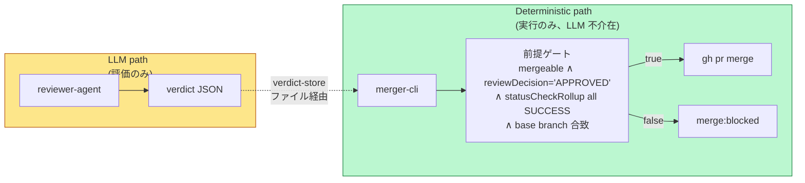

# 02 Architecture — PR Merger

> **Canonical source**: 00-design-decisions.md § T14 (2026-04-13, supersedes T12
> for runner-mediated flow depiction)。T12 継承: canMerge/mergePr responsibility
> split。T10 継承: outcome/reason/gate 順序。T8 継承: outcome
> 名一覧。Scheduler/Reason/issueStore は T10 + 03-data-flow.md を参照。

## 全体構成図

```mermaid
flowchart LR
    subgraph GH[GitHub]
        PR[Pull Request]
        LBL[Labels: merge:ready/blocked/done]
        API[GitHub API: mergeable/reviewDecision/statusCheckRollup]
    end

    subgraph LLM_PATH["LLM path (非決定論)"]
        direction TB
        RA[reviewer-agent<br/>既存・非変更]
        VS[(verdict-store<br/>tmp/climpt/orchestrator/emits/ PR .json)]
        RA -->|writes verdict JSON| VS
    end

    subgraph DET_PATH["Deterministic path (LLM 不介在)"]
        direction TB
        WMO[workflow-merge<br/>orchestrator<br/>actionable phase handler]
        RUN[agent runner<br/>agents/scripts/run-agent.ts<br/>+ AgentRunner + boundary-hooks]
        MC[merger-cli<br/>agents/scripts/merge-pr.ts]
        GATE{前提ゲート<br/>純関数ブール合成}
        WMO -->|spawn run-agent.ts<br/>--issue n --pr n --verdict-path path| RUN
        RUN -->|closure step "merge"<br/>Deno.Command で spawn<br/>${context.*} substitute 済| MC
        MC --> GATE
    end

    subgraph IMPL["workflow-impl orchestrator (既存・並走)"]
        direction TB
        ITER[iterator]
        REV[reviewer closure]
        ITER --> REV
        REV -.->|approved| RA
    end

    PR -->|read-only<br/>gh pr view/diff/checks + github_read MCP| RA
    VS -->|read verdict| MC
    MC -->|read| API
    API -->|json fields| GATE
    GATE -->|all true| MERGE[gh pr merge<br/>nested subprocess]
    MERGE --> PR
    MC -->|apply| LBL
    RA -.->|apply merge:ready| LBL
    LBL -.->|phase pick<br/>(orchestrator actionable)| WMO

    classDef llm fill:#fde68a,stroke:#b45309,color:#78350f
    classDef det fill:#bbf7d0,stroke:#15803d,color:#14532d
    classDef existing fill:#e5e7eb,stroke:#4b5563,color:#1f2937
    class RA,VS llm
    class WMO,RUN,MC,GATE,MERGE det
    class ITER,REV,PR,LBL,API existing
```

**読み方**:

- 黄色 (LLM path) の出力は必ず verdict-store を経由して緑 (Deterministic path)
  に渡る。LLM は merge の実行経路に直接介在しない。
- `gh pr merge` は merger-cli subprocess 内で実行される。merger-cli は agent
  runner の孫 subprocess であり、SDK tool-policy (BOUNDARY_BASH_PATTERNS) は
  nested subprocess 経由の呼出に発動しない (T14 Decision 3、F10 parent-process
  免除と同原理)。
- workflow-impl (既存) と workflow-merge (新規) は並走する
  (F1)。破線は非同期ハンドオフ (ラベル経由)。

## コンポーネント責務表

| コンポーネント                  | 種別                                                                    | 入力                                                                        | 出力                                                              | 責務                                                                                                                                                                                                                                                                                                                                                                                | LLM |
| ------------------------------- | ----------------------------------------------------------------------- | --------------------------------------------------------------------------- | ----------------------------------------------------------------- | ----------------------------------------------------------------------------------------------------------------------------------------------------------------------------------------------------------------------------------------------------------------------------------------------------------------------------------------------------------------------------------- | --- |
| **reviewer-agent**              | LLM agent (既存)                                                        | PR 本体 (gh pr view/diff/checks, github_read MCP)                           | verdict JSON (via orchestrator の永続化層) + `merge:ready` ラベル | PR の評価・判定。承認/差戻し/CI 待ち等の判断。**本設計ではプロンプト変更なし**。                                                                                                                                                                                                                                                                                                    | Yes |
| **workflow-merge orchestrator** | 新規 (既存 orchestrator の別 workflow.json)                             | `.agent/workflow-merge.json`, GitHub labels                                 | issue phase 遷移, agent runner 起動                               | `merge-ready` phase の issue を actionable phase handler で pick し、`agents/scripts/run-agent.ts` を subprocess で起動して merger agent を dispatch する (00-design-decisions.md § T14 Decision 1)。既存 orchestrator のコードを再利用 (F1, F2, F3)。                                                                                                                              | No  |
| **agent runner**                | 既存 (`agents/scripts/run-agent.ts` + `AgentRunner` + `boundary-hooks`) | CLI args (`--issue`, `--pr`, `--verdict-path`) + `.agent/merger/agent.json` | closure step spawn                                                | `run-agent.ts` が agent.json を load、`AgentRunner` が closure step `"merge"` を dispatch、`${context.*}` template を substitute して `merge-pr.ts` を subprocess として起動。本設計は Phase 0 prerequisite (template substitution / issue.payload binding / closure subprocess kind) を要する (00-design-decisions.md § T14 Decision 2)。**LLM 非介在** (closure は prompt なし)。 | No  |
| **merger-cli**                  | 新規 CLI (`agents/scripts/merge-pr.ts`)                                 | `--pr <number>`, verdict JSON path                                          | exit code, `merge:done`/`merge:blocked` label, verdict outcome    | verdict を読み (不在時は step -1 で `verdict-missing` → `rejected`)、`args.pr === verdict.pr_number` を照合し (step -0.5)、GitHub API で前提ゲートを評価し、全真なら `gh pr merge` を実行する。**LLM 非介在**。                                                                                                                                                                     | No  |
| **verdict-store**               | ファイルストア                                                          | reviewer-agent の出力                                                       | `tmp/climpt/orchestrator/emits/<pr-number>.json`                  | verdict の JSON 永続化。reviewer-agent が書き、merger-cli が読む。並走安全のため per-PR ファイル分離。                                                                                                                                                                                                                                                                              | No  |
| **既存 iterator**               | LLM agent (既存)                                                        | 既存 workflow-impl                                                          | 既存の通り                                                        | **非干渉**: 本設計では一切変更しない (F5)。                                                                                                                                                                                                                                                                                                                                         | Yes |
| **既存 reviewer closure**       | closure step (既存)                                                     | 既存 workflow-impl                                                          | 既存の通り + verdict JSON と `merge:ready` ラベル (追加出力)      | reviewer-agent が承認判定したとき、orchestrator の既存 label 付与機構 (F4) を通じて `merge:ready` を付ける。プロンプト本体は無変更。                                                                                                                                                                                                                                                | Yes |

## LLM 境界



**境界条件**:

1. LLM path の出力は **必ず JSON ファイル (verdict-store)**
   を経由する。メモリ内の直接呼び出しやパイプはしない。
2. Deterministic path の入力は **verdict JSON と GitHub API のみ**。LLM
   プロンプトや MCP tool は呼ばない。
3. 前提ゲートは 4 つの独立条件の **AND 合成**。全て GitHub API
   から取得する事実ベース値:
   - `mergeable === "MERGEABLE"`
   - `reviewDecision === "APPROVED"`
   - `statusCheckRollup` の全要素が `conclusion === "SUCCESS"` (skipped/neutral
     は除外ルール要検討、詳細は 03)
   - `baseRefName` が許可リスト (例: `develop`, `main`) に合致
4. いずれかが偽なら merger-cli は `merge:blocked` ラベルを付けて exit
   1。`gh pr merge` は呼ばない。
5. verdict の `outcome` フィールドと前提ゲートの AND が最終判定。verdict
   だけでも、ゲートだけでも merge には不十分。

## 既存への非干渉証明

本設計で **変更しないファイル**
を列挙する。設計レビュー時にこのリストを根拠に非干渉を確認する。

| ファイル/領域                                                               | 非干渉の根拠                                                                                                                                                                                                                                                                                                        |
| --------------------------------------------------------------------------- | ------------------------------------------------------------------------------------------------------------------------------------------------------------------------------------------------------------------------------------------------------------------------------------------------------------------- |
| `agents/common/tool-policy.ts` (`BOUNDARY_BASH_PATTERNS`, `BOUNDARY_TOOLS`) | F5 より global block なので変更すると全 agent に影響する。merger-cli は agent runner 経由の孫 subprocess として起動され、SDK tool-policy は nested subprocess 呼出に発動しない (T14 Decision 3)。F7 の `githubPrMerge` スタブも放置。                                                                               |
| `agents/runner/boundary-hooks.ts`                                           | F6 の boundary hook は iterator/reviewer の closure step 内で `Deno.Command("gh",...)` を実行する機構。merger 用 closure step は `boundary-hooks.ts` の共通機構を通過するが、本設計では hook の挙動を拡張しない (Phase 0-b の template substitution 拡張は AgentRunner 側で行う)。                                  |
| `agents/verdict/external-state-adapter.ts`                                  | `githubPrMerge` ハンドラ追加は F7 で未実装だが、本設計では追加しない。LLM → adapter → `gh pr merge` の経路そのものを排除するため、ハンドラが不要。                                                                                                                                                                  |
| reviewer agent prompt / steps_registry.json                                 | プロンプト変更なし。reviewer の出力フォーマットから orchestrator 層で artifact を導出するため、prompt 側の修正は不要 (導出主体は後述 §ArtifactEmitter — workflow-driven artifact emission を参照)。                                                                                                                 |
| iterator agent prompt / steps_registry.json                                 | 完全非干渉。iterator は merge に関与しない。                                                                                                                                                                                                                                                                        |
| `agents/orchestrator/workflow-loader.ts`                                    | F1, F2, F3 の既存機能 (`--workflow`, `labelPrefix`, `issueStore.path`) を流用するのみ。ローダ自体の変更不要。                                                                                                                                                                                                       |
| `agents/scripts/run-agent.ts`                                               | T14 で本設計は `run-agent.ts` に依存する方針へ変更 (workflow-merge orchestrator → run-agent.ts → merger-cli の 3 層構造)。ただし本 PR 内での直接変更は行わず、Phase 0 prerequisite (issue.payload → agent.parameters binding、closure.runner.args template substitution) として別 PR または先行コミットで拡張する。 |
| `agents/common/worktree.ts` (`finalizeWorktreeBranch`)                      | F10 のパターンは参考にするが流用はしない。merger-cli は独立した entry point。                                                                                                                                                                                                                                       |

**追加/新規ファイル** は以下のみ (詳細は `05-implementation-plan.md`):

- `agents/scripts/merge-pr.ts` (merger-cli 本体, 新規)
- `.agent/workflow-merge.json` (workflow 定義, 新規)
- `tmp/climpt/orchestrator/emits/<pr-number>.json` (runtime 生成,
  新規ディレクトリ)
- verdict schema 定義 (TypeScript type のみ, 配置は実装計画で決定)

**変更が許されるファイル** (設計ドキュメント外):

- `deno.json` の tasks 節に `agent-merge`
  等のタスクを追加する可能性はある。ただしこれは実装計画
  (05-implementation-plan.md) で決定する。

## 並走時の相互作用

workflow-impl と workflow-merge は独立した issue-store / label
名前空間を持つため、相互のロック競合や phase 誤遷移は発生しない
(F3)。両者の接続点は以下のみ:

1. **Label `merge:ready` の授受**: workflow-impl の reviewer が承認 →
   `merge:ready` 付与 → workflow-merge の actionable phase handler が
   `merge-ready` phase issue を pick。
2. **Verdict JSON の授受**: workflow-impl の reviewer closure が書く →
   merger-cli が読む。
3. **GitHub PR の状態**: 両 workflow とも同じ PR を参照するが、workflow-impl
   は読み取り + push のみ、workflow-merge は merge のみ。書き込み先が排他。

これらの接続点は全て **ファイル** または **GitHub API**
経由で、プロセス内共有状態を持たない。

## エラー伝播とフェイルセーフ

Deterministic path における失敗モードと対処を明記する。

| 失敗点                                                                       | 検知方法                     | 対処                                                                                                                     | LLM 介在 |
| ---------------------------------------------------------------------------- | ---------------------------- | ------------------------------------------------------------------------------------------------------------------------ | -------- |
| verdict JSON 読み込み失敗 (ファイル不在)                                     | `Deno.readTextFile` の throw | `merge-blocked` 遷移 + PR コメント「verdict missing」                                                                    | No       |
| verdict JSON パースエラー                                                    | `JSON.parse` の throw        | `merge-blocked` 遷移 + PR コメント「verdict malformed」                                                                  | No       |
| `gh pr view --json ...` 失敗 (ネットワーク, 認証)                            | exit code 非 0               | merger-cli は exit 2 (retry 可能エラー)。workflow-merge の cycle 再試行に委ねる。                                        | No       |
| 前提ゲートの一部が false                                                     | 純関数評価の結果             | verdict outcome を `ci-pending` / `approvals-missing` / `conflicts` / `rejected` のいずれかに分類し、対応する phase 遷移 | No       |
| `gh pr merge` 失敗                                                           | exit code 非 0               | エラー種別を判定し、retriable なら `merge-ready` 維持、そうでなければ `merge-blocked`                                    | No       |
| verdict と GitHub 事実の乖離 (例: verdict=merged だが mergeable=CONFLICTING) | 前提ゲートで捕捉             | GitHub 事実を優先。verdict を信用せず `conflicts` として `merge-blocked`                                                 | No       |

**原則**: 不明な状態は全て `merge-blocked` に倒し、人間の判断を待つ。自動復旧は
`ci-pending` の self-loop のみ。

## プロセス境界と権限

| プロセス                      | 起動方法                                                                                                                                                                                                          | 権限                                                                                      | Deno flags                                                                      |
| ----------------------------- | ----------------------------------------------------------------------------------------------------------------------------------------------------------------------------------------------------------------- | ----------------------------------------------------------------------------------------- | ------------------------------------------------------------------------------- |
| workflow-impl orchestrator    | 既存 `deno task agent` 等                                                                                                                                                                                         | 既存通り                                                                                  | 既存通り                                                                        |
| workflow-merge orchestrator   | `deno task agent --workflow .agent/workflow-merge.json` (仮)                                                                                                                                                      | issue-store 書き込み, GitHub read, subprocess spawn (agent runner 経由で subprocess 起動) | `--allow-read --allow-write .agent --allow-run --allow-net`                     |
| agent runner (`run-agent.ts`) | workflow-merge orchestrator から subprocess spawn                                                                                                                                                                 | issueStore read, agent.json read, closure subprocess spawn                                | `--allow-read .agent --allow-write (metrics のみ) --allow-run=deno --allow-env` |
| merger-cli                    | workflow-merge orchestrator → `agents/scripts/run-agent.ts` → `AgentRunner` closure step runner から subprocess spawn (本番)、または手動 `deno run agents/scripts/merge-pr.ts --pr <n>` (ローカル dry-run 検証用) | GitHub API read + merge, label 変更, verdict read                                         | `--allow-read .agent --allow-run=gh --allow-net=api.github.com`                 |

merger-cli は最小権限。ファイル書き込み権限は持たず、GitHub への書き込みは `gh`
経由に限定。

## ArtifactEmitter — workflow-driven artifact emission

> **Canonical source**: `tmp/pr-merger-abstraction/abstraction-design.md` §2 /
> §3 (2026-04-14)。00-design-decisions.md § T16 (ArtifactEmitter 抽象化) により
> T15 (VerdictEmitter) を supersede する。infra は **具象 agent 名を一切
> 知らず**、handoff 動作は `workflow.json` 宣言で駆動される。

### Rationale

- infra 層 (orchestrator / dispatcher / runner / artifact-emitter) は
  `"reviewer"` / `"merger"` / `"iterator"` / `"verdict"` / `"pr"` いずれの
  literal も source / 型 / enum に持たない。handoff 挙動は **workflow.json の
  `handoffs[]` 宣言を opaque data として読む** ことで駆動される。
- reviewer agent は §7.1 により **プロンプト・schema・handoffFields 全て
  untouched**。したがって agent 側で artifact JSON を write する経路は
  設計上許されない。
- 一方 `merge-pr.ts` のような決定論 subprocess は、on-disk artifact
  (`tmp/climpt/orchestrator/emits/<pr>.json` 等)
  の存在を前提とする。ファイル化は必須要件。
- 両要件を両立する解は「dispatch 完了時の outcome と、`workflow.handoffs[]`
  の宣言を突き合わせ、該当する handoff ごとに orchestrator 層で artifact を
  合成・write する」こと。この責務を担う単一 component が `ArtifactEmitter`
  である (新規 orchestrator 層 module:
  `agents/orchestrator/artifact-emitter.ts`。 旧名 `verdict-emitter.ts` を
  rename)。
- 将来の LLM→決定論フロー (security-scan → deployer 等) を追加する際、 infra 側
  (`ArtifactEmitter` / `orchestrator.ts` / `dispatcher.ts` / `runner.ts`)
  への変更はゼロとなり、agent 定義追加 + `workflow.json` の `handoffs[]`
  エントリ追加のみで完結する (§7.1 非干渉原則の発展)。

### Component diagram

```mermaid
flowchart LR
    subgraph CFG[workflow config]
      WF[workflow.json<br/>handoffs[]<br/>payloadSchema]
      SR[schemaRegistry<br/>agents/orchestrator/<br/>schema-registry.ts]
    end
    subgraph ORC[orchestrator 層]
      OT[orchestrator.ts<br/>dispatch 完了 hook]
      AE[ArtifactEmitter<br/>agents/orchestrator/<br/>artifact-emitter.ts]
      IS[issueStore<br/>workflow payload]
    end
    subgraph FS[ファイルシステム]
      AF[(artifactPath<br/>handoff.emit.path)]
    end
    subgraph GH[GitHub]
      PR[gh pr view<br/>lazy fetch]
      LBL[labels]
    end

    WF -->|handoffs[] + payloadSchema| OT
    OT -->|1. filter handoffs<br/>by fromAgent + outcome| AE
    AE -->|2. resolve JSONPath| PR
    AE -->|3. resolve schema| SR
    AE -->|4. writeFile| AF
    AE -->|5. writeWorkflowPayload<br/>(if persistPayloadTo=issueStore)| IS
    OT -->|6. label transition| LBL

    style AE fill:#dfd,stroke:#15803d
    style OT fill:#dfd,stroke:#15803d
    style WF fill:#fff3bf,stroke:#8a6d00
    style SR fill:#fff3bf,stroke:#8a6d00
```

### Component contract

| 項目      | 内容                                                                                                                                                                                                                                                      |
| --------- | --------------------------------------------------------------------------------------------------------------------------------------------------------------------------------------------------------------------------------------------------------- |
| 位置      | `agents/orchestrator/artifact-emitter.ts` (新規、旧 `verdict-emitter.ts` の rename)                                                                                                                                                                       |
| 依存      | `IssueStore`、`SchemaRegistry` (`<name>@<semver>` の lookup)、`gh pr view` (JSONPath が `$.github.pr.*` を参照する場合のみ lazy fetch)、`clock.now()`、`writeFile`                                                                                        |
| 入力      | `ArtifactEmitInput { workflowId: string; issueNumber: number; sourceAgent: string; sourceOutcome: string; agentResult: Readonly<Record<string, unknown>>; handoff: HandoffDeclaration }`。`sourceAgent` / `sourceOutcome` は識別子文字列 (log 用途のみ)。 |
| 出力      | `ArtifactEmitResult { payload: Readonly<Record<string, unknown>>; artifactPath: string }` を return                                                                                                                                                       |
| 副作用    | (1) `handoff.emit.path` テンプレート展開後のパスへ artifact JSON を write。(2) `handoff.persistPayloadTo === "issueStore"` のとき `issueStore.writeWorkflowPayload(issueNumber, workflowId, payload)` で payload を persist。                             |
| 呼出点    | dispatch 完了直後、orchestrator が `workflow.handoffs.filter(h => h.when.fromAgent === dispatchedAgentId && h.when.outcome === result.outcome)` を評価し、該当する handoff ごとに 1 回ずつ呼出。該当ゼロなら呼出しない (specific agent 分岐なし)。        |
| LLM 介在  | なし。`payloadFrom` の JSONPath 解決と schema 検証を決定論的に実施するのみ。                                                                                                                                                                              |
| §7.1 影響 | reviewer agent.json / steps_registry.json / reviewer.schema.json / external-state-adapter.ts / tool-policy.ts いずれも untouched。拡張は orchestrator 層に完全閉包。                                                                                      |

TypeScript interface の具体 signature は `07-interfaces.md` §1-§2 を参照。

### Invocation (generic)

orchestrator は dispatch 結果の outcome と `workflow.handoffs[]` の宣言を
突き合わせるだけで、**agent-specific な if-branch を持たない**。

```typescript
// after any dispatch returns
const dispatchResult = await dispatcher.dispatch(
  dispatchedAgentId,
  issueNumber,
  options,
);

const matching = workflow.handoffs.filter((h) =>
  h.when.fromAgent === dispatchedAgentId &&
  h.when.outcome === dispatchResult.outcome
);

for (const handoff of matching) {
  const { payload, artifactPath } = await artifactEmitter.emit({
    workflowId: workflow.id,
    issueNumber,
    sourceAgent: dispatchedAgentId, // just a string
    sourceOutcome: dispatchResult.outcome,
    agentResult: dispatchResult.output,
    handoff,
  });
  logger.info(
    { handoffId: handoff.id, artifactPath },
    "handoff.emit.completed",
  );
}
```

`if (agentId === "reviewer")` のような分岐は存在せず、`dispatchedAgentId` は
workflow.agents の key として単なる string。PR Merger workflow での 具体挙動は
`.agent/workflow-merge.json` の `handoffs[]` 宣言 (§T16 / §06 参照)
のみが決定する。

### 既存 §133「プロンプト本体は無変更」との整合

コンポーネント責務表 §133 行 (既存 reviewer closure) の「プロンプト本体は
無変更」という記述は、本節 ArtifactEmitter が artifact 合成責務を workflow
宣言駆動で引き受けることで成立する。reviewer 側に verdict_payload field
を追加する必要はなく、`closure_handoff_fields.json` 新設も不要。

## Runner context composition

> **Canonical source**: `tmp/pr-merger-abstraction/abstraction-design.md` §4 /
> §5 (2026-04-14)。`runSubprocessClosureIteration` の context 合成ルールは
> **generic** で、特定 agent の key 名 (`prNumber` / `verdictPath` 等) を
> 型にも合成ロジックにも含まない。

### Rule

AgentRunner が closure step を dispatch する際、subprocess runner
(`${context.*}` template substitution) に渡す `context` は以下の合成で作る:

```text
context = { ...(issuePayload ?? {}), ...agentParameters }
```

- `issuePayload` の型は `Readonly<Record<string, unknown>>`。infra は key 名
  を知らず、workflow.json の `payloadSchema` で validate された opaque data
  として扱う。
- **agentParameters 優先** (右側 spread): CLI 引数は user-authoritative の
  ため、直接 `deno task agent-merge --<param> <value>` 等で上書きが可能で
  あるべき。debugging / manual re-run を妨げない。
- **issuePayload は base**: orchestrator が issueStore から読み出した
  `Record<string, unknown>` を AgentRunner.run の option (`issuePayload?`)
  として受け取り、context base に据える。

> **Note (PR Merger 具体ケース)**: `.agent/workflow-merge.json` の
> `payloadSchema` が `prNumber` / `verdictPath` を要求する場合、payload は
> それらを key として含み、`${context.prNumber}` / `${context.verdictPath}`
> のテンプレート展開が成立する。ただし **infra はこの key 名を知らず**、 単に
> Record 全体を spread するだけ。

### 振る舞いの分岐 (generic)

| dispatcher 呼出元              | `issuePayload` 供給             | AgentRunner の挙動                                                                                                                                  |
| ------------------------------ | ------------------------------- | --------------------------------------------------------------------------------------------------------------------------------------------------- |
| 先行 handoff なしの dispatch   | `undefined` (従来挙動)          | `context = { ...agentParameters }` — 既存挙動を 100% 保つ (後方互換性)。closure が `${context.*}` を参照しないならば non-regression。               |
| 先行 handoff あり (issueStore) | issueStore から読出した payload | `context = { ...payload, ...agentParameters }`。agent.json の closure.runner.args 中の `${context.<payloadKey>}` が payload の key から解決される。 |

### §7.1 遵守

`AgentRunnerRunOptions.issuePayload` は **optional** であるため、先行 handoff
が存在しない経路は option 未指定で従来動作。本変更は `runner.ts` の
拡張のみで、禁止対象 (tool-policy.ts / external-state-adapter.ts / worktree.ts
等) には一切手を入れない。

`issuePayload` の型が `Readonly<Record<string, unknown>>` であることにより、
runner は特定 workflow の固有 key に依存しない (`reviewer` / `merger` /
`verdict` / `pr` いずれの literal も持たない)。

TypeScript interface の具体 signature は `07-interfaces.md` §6 を参照。
