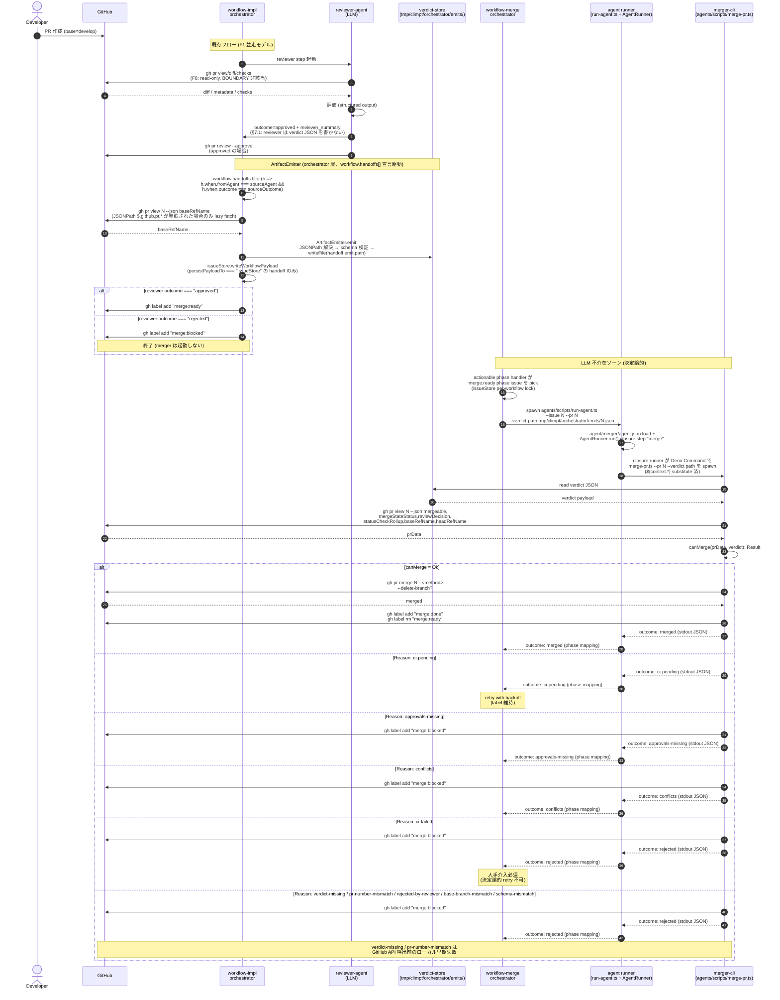

# 03. Data Flow

> **Canonical source**: 00-design-decisions.md § T14 (2026-04-13, supersedes
> T10/T12 for runner-mediated sequence depiction)。T12 継承: canMerge/mergePr
> responsibility split。T10 継承: outcome/reason/gate 順序。T8 継承: outcome
> 名一覧。(§ T10 supersedes T8 for reason list; T8 still valid for outcome list;
> § T12 supersedes T10 for canMerge/mergePr responsibility split; § T14
> supersedes T12 for runner-mediated sequence depiction)

PR Merger のデータフロー設計。AI (reviewer) と機械 (merger-cli)
の境界を明示し、`gh pr merge` 実行経路に LLM が介在しないことを保証する。

## 1. End-to-end シーケンス図



### 主要ポイント

- ステップ 1-10: LLM を通る領域 (reviewer-agent による評価)
- ステップ 11 以降: LLM 不介在。merger-cli は純粋に verdict + GitHub state
  を参照し `gh pr merge` を決定論的に実行
- `merge:ready` ラベルは AI → 機械の引渡しトークン
- `merge:done` / `merge:blocked` は機械側が付与する最終状態
- artifact JSON の writer は reviewer ではなく **orchestrator 層の
  ArtifactEmitter** (02-architecture.md §ArtifactEmitter 参照)。§7.1 非干渉
  制約により reviewer は artifact JSON を write しない。artifact emission は
  `workflow.handoffs[]` 宣言により駆動され、infra 側には specific agent 名の
  分岐が存在しない。

### 1.1 Payload → RunnerArgs binding rule (generic)

> **Canonical source**: `tmp/pr-merger-abstraction/abstraction-design.md` §4 /
> §5 (2026-04-14)。`dispatcher.ts` における `IssueWorkflowState.payload` から
> `AgentRunner.run(options)` への変換を generic rule として定義する。

orchestrator が agent を dispatch する際、issueStore から読み出した
`payload: IssuePayload` (`= Readonly<Record<string, unknown>>`) は以下の generic
rule で `runnerArgs` と `issuePayload` option に展開される。

#### Binding rule (agent-agnostic)

```
for key of agent.json.parameters:
  if payload[key] !== undefined:
    runnerArgs[key] ← payload[key]
```

`agents/scripts/run-agent.ts:517-529` の kebab→camel 自動 mapping を経由し、 CLI
arg (`--<kebab-key>`) として subprocess に渡り、`definition.parameters` declared
key へ bind される。最終的に `${context.<key>}` template 展開に
利用できる。dispatcher / runner は **payload の具体 key 名を知らない** —
agent.json の parameters 宣言が唯一の binding source of truth。

#### PR Merger 具体実現例 (concrete realization)

下表は `.agent/workflow-merge.json` が `payloadSchema` で `prNumber` /
`verdictPath` を宣言し、`.agent/merger/agent.json` が同名 parameter を宣言
した場合の具象展開。infra 契約には現れず、workflow config 層の決定事項。

| issue.payload field | runnerArgs key | agent.json parameter   | CLI arg (kebab)  | Required? |
| ------------------- | -------------- | ---------------------- | ---------------- | :-------: |
| `prNumber`          | `prNumber`     | `prNumber` (number)    | `--pr-number`    |    yes    |
| `verdictPath`       | `verdictPath`  | `verdictPath` (string) | `--verdict-path` |    yes    |

(既存 runnerArgs key である `issue` / `iterateMax` / `branch` / `issueStorePath`
/ `outboxPath` は本テーブル対象外。これらは従来どおり `DispatchOptions`
の他フィールドから生成され、payload 経路とは独立。)

#### 欠損時挙動 (generic)

| 条件                                                  | 挙動                                                                                                                                                                                                                                                 |
| ----------------------------------------------------- | ---------------------------------------------------------------------------------------------------------------------------------------------------------------------------------------------------------------------------------------------------- |
| `DispatchOptions.payload` 自体が `undefined`          | dispatcher は payload 由来の key を `runnerArgs` に注入しない。AgentRunner へ渡す `issuePayload` も `undefined`。→ 既存挙動 100% 保持 (後方互換性)。                                                                                                 |
| `payload` は存在するが必須 parameter field が欠落     | `run-agent.ts` の既存 `definition.parameters.*.required` バリデーションが exit 1 で失敗する (silent default は設けない)。workflow config の `payloadSchema` (Ajv) と agent.json `parameters` を一致させることで、欠損は起動前/起動時いずれかで検出。 |
| `payload` に追加 field (agent.json parameter 外) 含む | dispatcher は agent.json が宣言する key のみを展開する。未知 field は runnerArgs に流れない (意図しない引数汚染を防止)。                                                                                                                             |

#### 優先度

CLI 直接起動 (`deno task agent-<name> --<kebab-key> <value>`) が payload 経路
と競合した場合、**CLI arg が勝つ**。理由: direct CLI 起動は debug / manual
re-run の主要経路であり、orchestrator が管理する payload を人間が上書き
できる柔軟性を担保する必要がある。

この優先ルールは AgentRunner 側 context 合成
`context = { ...(issuePayload ?? {}), ...agentParameters }` (02-architecture.md
§Runner context composition 参照) と一致する (右側 spread が勝つ =
agentParameters (= CLI args 由来) が勝つ)。

TypeScript 具体 signature は `07-interfaces.md` §5 (DispatchOptions) と §6
(AgentRunnerRunOptions) を参照。

### 1.2 Handoff Declaration (workflow.json)

> **Canonical source**: `tmp/pr-merger-abstraction/abstraction-design.md` §2
> (2026-04-14)。`workflow.json.handoffs[]` が ArtifactEmitter の emission を
> **宣言的に駆動** する。infra 側に specific agent-name 分岐は存在しない。

#### Schema

`workflow.json` に以下の `handoffs` 配列を追加する。`payloadSchema`
(`IssuePayload` の Ajv 検証用) と併存する。

```jsonc
{
  "handoffs": {
    "type": "array",
    "items": {
      "type": "object",
      "required": ["id", "when", "emit", "payloadFrom", "persistPayloadTo"],
      "properties": {
        "id": {
          "type": "string",
          "pattern": "^[a-z][a-z0-9-]*$",
          "description": "workflow 内でユニークな handoff 識別子"
        },
        "when": {
          "type": "object",
          "required": ["fromAgent", "outcome"],
          "properties": {
            "fromAgent": {
              "type": "string",
              "description": "agents[] の key (データ値)"
            },
            "outcome": {
              "type": "string",
              "description": "Canonical Outcome 文字列"
            }
          },
          "additionalProperties": false
        },
        "emit": {
          "type": "object",
          "required": ["type", "schemaRef", "path"],
          "properties": {
            "type": { "type": "string", "description": "artifact 種別タグ" },
            "schemaRef": {
              "type": "string",
              "description": "registered schema id, 例: pr-merger-verdict@1.0.0"
            },
            "path": {
              "type": "string",
              "description": "書き込み先テンプレート、${payload.*} 展開可"
            }
          },
          "additionalProperties": false
        },
        "payloadFrom": {
          "type": "object",
          "additionalProperties": {
            "type": "string",
            "description": "JSONPath 式 / 'literal'"
          },
          "description": "payload key → source JSONPath mapping"
        },
        "persistPayloadTo": { "enum": ["issueStore", "none"] }
      },
      "additionalProperties": false
    }
  }
}
```

#### PR Merger 向け宣言例

```jsonc
{
  "handoffs": [
    {
      "id": "reviewer-approved-verdict",
      "when": { "fromAgent": "reviewer", "outcome": "approved" },
      "emit": {
        "type": "verdict",
        "schemaRef": "pr-merger-verdict@1.0.0",
        "path": "tmp/climpt/orchestrator/emits/${payload.prNumber}.json"
      },
      "payloadFrom": {
        "prNumber": "$.github.pr.number",
        "verdictPath": "tmp/climpt/orchestrator/emits/${payload.prNumber}.json",
        "schema_version": "'1.0.0'",
        "pr_number": "$.github.pr.number",
        "base_branch": "$.github.pr.baseRefName",
        "verdict": "$.agent.result.outcome",
        "reviewer_summary": "$.agent.result.summary",
        "evaluated_at": "$.workflow.context.now",
        "reviewer_agent_version": "$.workflow.agents[sourceAgent].version",
        "ci_required": "'true'"
      },
      "persistPayloadTo": "issueStore"
    }
  ]
}
```

上記は `.agent/workflow-merge.json` に追加される想定。handoff の具体追加は
05-implementation-plan.md の Phase 0 prerequisite (`schemaRegistry` 新設) と
共にロールアウトされる (本 PR では `.agent/workflow-merge.json` は untouched、
T5' タスクで handoffs[] 追加を予定)。

#### JSONPath 解決規則

| root / 記法                 | 意味                                                                                         |
| --------------------------- | -------------------------------------------------------------------------------------------- |
| `$.agent.result.*`          | dispatch 結果 (`ArtifactEmitInput.agentResult`) から解決                                     |
| `$.github.pr.*`             | `gh pr view <prNumber>` を lazy fetch して取得                                               |
| `$.workflow.context.*`      | orchestrator が inject する定数 (例: `now` = clock.now().toISOString())                      |
| `$.workflow.agents[<id>].*` | `workflow.agents[id]` から解決。`[sourceAgent]` は sentinel で input の `sourceAgent` に解決 |
| `'<literal>'`               | シングルクォート囲みはリテラル文字列 (JSON 型推論なし、schema 側で型強制)                    |
| `${payload.<key>}`          | `emit.path` 内で payload 解決後に展開される simple template                                  |

#### fail-fast 規則

- `payloadFrom` の JSONPath が `undefined` を返す → `HandoffResolveError` を
  throw。orchestrator が `handoff-error` outcome に写像して issue を blocking
  phase へ遷移。
- `schemaRef` が `schemaRegistry` に未登録 → workflow load 時に error。
- `${payload.<key>}` が path template 展開時に未定義 → error (silent default
  なし)。

infra の dispatcher / runner / orchestrator いずれも、これらの宣言を
agent-specific に解釈しない。PR Merger 固有の `"reviewer"` / `"approved"` /
`"pr-merger-verdict@1.0.0"` 等の文字列は **workflow.json データ内にのみ 存在**
し、infra 契約には現れない。

## 2. Verdict JSON スキーマ

パス: `tmp/climpt/orchestrator/emits/<pr-number>.json`

### JSON Schema (Draft 2020-12)

```json
{
  "$schema": "https://json-schema.org/draft/2020-12/schema",
  "$id": "https://climpt.dev/schemas/pr-merger/verdict-1.0.0.json",
  "title": "PR Merger Verdict",
  "type": "object",
  "required": [
    "schema_version",
    "pr_number",
    "base_branch",
    "verdict",
    "reviewer_summary",
    "evaluated_at",
    "reviewer_agent_version"
  ],
  "properties": {
    "schema_version": {
      "type": "string",
      "const": "1.0.0",
      "description": "Verdict schema の semver。merger-cli は major 一致を要求し、不一致時は outcome: rejected"
    },
    "pr_number": {
      "type": "integer",
      "minimum": 1,
      "description": "GitHub PR number"
    },
    "base_branch": {
      "type": "string",
      "minLength": 1,
      "description": "評価時点の base branch。prData.baseRefName と一致しない場合は base-branch-mismatch"
    },
    "verdict": {
      "type": "string",
      "enum": ["approved", "rejected"],
      "description": "reviewer-agent の最終判定"
    },
    "merge_method": {
      "type": "string",
      "enum": ["squash", "merge", "rebase"],
      "description": "approved 時のマージ方式。rejected では無視"
    },
    "delete_branch": {
      "type": "boolean",
      "default": true,
      "description": "マージ後に head branch を削除するか"
    },
    "reviewer_summary": {
      "type": "string",
      "minLength": 1,
      "maxLength": 4000,
      "description": "人間可読な評価サマリ (PR comment 用)"
    },
    "evaluated_at": {
      "type": "string",
      "format": "date-time",
      "description": "ISO 8601 UTC (例: 2026-04-12T03:14:15Z)"
    },
    "reviewer_agent_version": {
      "type": "string",
      "pattern": "^\\d+\\.\\d+\\.\\d+(-[\\w.]+)?$",
      "description": "reviewer agent の semver。トレーサビリティ用"
    },
    "ci_required": {
      "type": "boolean",
      "default": true,
      "description": "false にすると CI 未完了でもマージ可 (緊急用エスケープ)"
    }
  },
  "allOf": [
    {
      "if": { "properties": { "verdict": { "const": "approved" } } },
      "then": { "required": ["merge_method"] }
    }
  ],
  "additionalProperties": false
}
```

### サンプル: approved

```json
{
  "schema_version": "1.0.0",
  "pr_number": 472,
  "base_branch": "develop",
  "verdict": "approved",
  "merge_method": "squash",
  "delete_branch": true,
  "reviewer_summary": "All acceptance criteria satisfied. Type checks green. No breaking changes detected on public API surface. CHANGELOG updated.",
  "evaluated_at": "2026-04-12T09:31:04Z",
  "reviewer_agent_version": "1.13.26",
  "ci_required": true
}
```

### サンプル: rejected

```json
{
  "schema_version": "1.0.0",
  "pr_number": 473,
  "base_branch": "develop",
  "verdict": "rejected",
  "delete_branch": true,
  "reviewer_summary": "Tests missing for new public function `mergePr()`. Hardcoded expected values violate test-design rule. Request changes before re-submitting.",
  "evaluated_at": "2026-04-12T09:42:11Z",
  "reviewer_agent_version": "1.13.26",
  "ci_required": true
}
```

### サンプル: 緊急マージ (CI skip)

```json
{
  "schema_version": "1.0.0",
  "pr_number": 474,
  "base_branch": "main",
  "verdict": "approved",
  "merge_method": "merge",
  "delete_branch": false,
  "reviewer_summary": "Hotfix for production outage. CI is timing out on unrelated infra flake; approved to bypass with human ack.",
  "evaluated_at": "2026-04-12T10:05:00Z",
  "reviewer_agent_version": "1.13.26",
  "ci_required": false
}
```

## 3. 前提ゲート仕様

merger-cli は `gh pr view` から以下のフィールドを取得し、純関数 `canMerge`
で判定する。

### 取得コマンド

```
gh pr view N --json mergeable,mergeStateStatus,reviewDecision,statusCheckRollup,baseRefName,headRefName
```

### A. `mergePr(args)` CLI wrapper 手続き

merger-cli のエントリ。ファイル I/O・スキーマ検証・pr_number 照合・GitHub API
呼出・ラベル操作といった副作用はすべて wrapper に閉じ込め、純関数 `canMerge`
には `(prData, verdict)` のみを渡す。Amendment T12 Decision 1 により、T10 で
canMerge 内部に混入していた wrapper 層の責務 (verdict-missing,
pr-number-mismatch) は本ブロックへ移設する。

```typescript
type MergePrArgs = {
  pr: number; // CLI --pr N
  verdictPath: string; // CLI --verdict <path>
  dryRun: boolean;
};

function mergePr(args: MergePrArgs): Promise<MergeOutcome>;
```

```
mergePr(args):
  1. verdict ファイル (args.verdictPath) は存在するか？
     NO → Err("verdict-missing") → 早期 return (canMerge 未呼出)
        (merge:ready ラベルが付いているのに verdict JSON 不在 = 人手介入必須。
         ファイル不在では JSON parse も schema 検証も実行不能なため最優先で弾く)

  2. verdict ファイルを読込み JSON parse → JSON Schema (Draft 2020-12) validate
     parse error / schema violation → Err("schema-mismatch") → 早期 return
        (schema_version major 不一致もここで検出。canMerge 内の step 0 は純関数を
         直接呼ぶテスト/別経路の safety guard として残す)

  3. args.pr === verdict.pr_number か？
     NO → Err("pr-number-mismatch") → 早期 return
        (誤った verdict 参照の運用事故防止。純ローカル照合で GitHub API 呼出不要のため、
         step 4 より前に配置し、無駄な API call を防ぐ)

  4. gh pr view N --json mergeable,mergeStateStatus,reviewDecision,
                         statusCheckRollup,baseRefName,headRefName
     → prData

  5. canMerge(prData, verdict) を呼出
     Err(reason) → outcome 写像 + label 付与へ (step 7)
     Ok          → step 6

  6. args.dryRun ?
     true  → outcome: "would-merge" を返し終了 (step 7 未実行)
     false → step 7 へ

  7. gh pr merge N --<verdict.merge_method> [--delete-branch]
     success → gh label add "merge:done" / gh label rm "merge:ready"
              → outcome: merged
     failure → outcome: rejected + merge:blocked ラベル
```

### B. `canMerge(prData, verdict)` 純関数

決定論的な gate 評価のみを担う。副作用なし、ファイル I/O なし、ネットワーク I/O
なし。引数は `(prData, verdict)` の 2 つに固定し、`cli_args` は受け取らない
(Amendment T12 Decision 1)。

```typescript
type CanMergeReason =
  | "verdict-missing" // wrapper step 1 で発生 (canMerge は produce しない)
  | "pr-number-mismatch" // wrapper step 3 で発生 (canMerge は produce しない)
  | "schema-mismatch" // wrapper step 2 が一次、canMerge step 0 が safety guard
  | "rejected-by-reviewer" // canMerge step 1
  | "unknown-mergeable" // canMerge step 2
  | "conflicts" // canMerge step 2
  | "approvals-missing" // canMerge step 3
  | "ci-pending" // canMerge step 4
  | "ci-failed" // canMerge step 4
  | "base-branch-mismatch"; // canMerge step 5

function canMerge(
  prData: PrData,
  verdict: Verdict,
): Result<void, CanMergeReason>;
```

上から順に評価し、最初に失敗した条件で即
Err。並び順は「壊れているほど早く返す」原則。

```
canMerge(prData, verdict):
  0. verdict.schema_version の major が 1 か？
     NO → Err("schema-mismatch")
        (wrapper step 2 が JSON Schema validate で既に検証済みだが、
         純関数を直接呼ぶ caller (テスト・将来の別経路) への safety guard として保持する)

  1. verdict.verdict === "approved" か？
     NO → Err("rejected-by-reviewer")

  2. prData.mergeable === "MERGEABLE" か？
     "CONFLICTING"        → Err("conflicts")
     "UNKNOWN" / null     → Err("unknown-mergeable")
     "MERGEABLE"          → continue

  3. prData.reviewDecision === "APPROVED" か？
     "REVIEW_REQUIRED"    → Err("approvals-missing")
     "CHANGES_REQUESTED"  → Err("approvals-missing")
     null                 → Err("approvals-missing")
     "APPROVED"           → continue

  4. verdict.ci_required が true か？
     false → skip (step 5)
     true  → statusCheckRollup を評価
        any conclusion === "FAILURE"/"CANCELLED"/"TIMED_OUT" → Err("ci-failed")
        any status     === "QUEUED"/"IN_PROGRESS"/"PENDING"  → Err("ci-pending")
        all success                                          → continue

  5. verdict.base_branch === prData.baseRefName か？
     NO → Err("base-branch-mismatch")
        (reviewer 評価後に rebase された等のケース)

  6. 全通過 → Ok(void)
```

### 責務分担 (どの Reason をどの層が produce するか)

- **wrapper 層 (`mergePr`) のみが produce**: `verdict-missing` (step 1),
  `pr-number-mismatch` (step 3)
- **wrapper 層が一次、canMerge が safety guard**: `schema-mismatch` (wrapper
  step 2 / canMerge step 0)
- **canMerge 層のみが produce**: `rejected-by-reviewer`, `unknown-mergeable`,
  `conflicts`, `approvals-missing`, `ci-pending`, `ci-failed`,
  `base-branch-mismatch`

### Reason ↔ Canonical Outcome 対応表

merger-cli の終了コードとラベル付与は Canonical Outcome 経由で決まる。

| canMerge Reason        | Canonical Outcome   | 付与ラベル      | retry 対象 | 備考                                                                    |
| ---------------------- | ------------------- | --------------- | :--------: | ----------------------------------------------------------------------- |
| (Ok)                   | `merged`            | `merge:done`    |     -      | `merge:ready` を外す                                                    |
| `verdict-missing`      | `rejected`          | `merge:blocked` |     ×      | verdict ファイル不在のまま merge:ready ラベルが付いた状態、人手介入必須 |
| `schema-mismatch`      | `rejected`          | `merge:blocked` |     ×      | 手動再評価が必要                                                        |
| `pr-number-mismatch`   | `rejected`          | `merge:blocked` |     ×      | `args.pr !== verdict.pr_number`、誤った verdict 参照の運用事故防止      |
| `rejected-by-reviewer` | `rejected`          | `merge:blocked` |     ×      | verdict 上書きが必要                                                    |
| `unknown-mergeable`    | `ci-pending`        | (維持)          |     ○      | GitHub 再計算待ち                                                       |
| `conflicts`            | `conflicts`         | `merge:blocked` |     ×      | rebase が必要                                                           |
| `approvals-missing`    | `approvals-missing` | `merge:blocked` |     ×      | 人手承認が必要                                                          |
| `ci-pending`           | `ci-pending`        | (維持)          |     ○      | backoff retry                                                           |
| `ci-failed`            | `rejected`          | `merge:blocked` |     ×      | CI 失敗は人手介入必須 (決定論的 retry 不可)                             |
| `base-branch-mismatch` | `rejected`          | `merge:blocked` |     ×      | verdict 再生成が必要                                                    |

Canonical Outcome は `merged` / `ci-pending` / `approvals-missing` / `conflicts`
/ `rejected` の 5 値に限定 (00-design-decisions.md § T8 準拠、Amendment T10
で継承)。merger-cli 内部 Reason はより細分化されるが、外部契約では上表の Outcome
に写像する。

Gate 評価順序は 2 層構造 (Amendment T12 準拠): **wrapper step 1-3 (local
early-fail: verdict-missing → schema-mismatch → pr-number-mismatch) → canMerge
step 0-5 (pure gates: schema safety guard → verdict → mergeable → approvals → CI
→ base branch)**。wrapper step 1-3 はローカルチェックで GitHub API
呼出不要、誤った verdict や不在時に無駄な API call を発生させずに即 Err
する。canMerge step 0-5 は副作用なしの純関数で決定論的に判定する。

## 4. データフロー境界表

「どのデータがどのコンポーネント間で流れるか」「LLM を通るか」を明示する。

| #  | データ                                                        | 出所                                        | 送り先                                              | LLM 介在 | 形式                             |
| -- | ------------------------------------------------------------- | ------------------------------------------- | --------------------------------------------------- | :------: | -------------------------------- |
| 1  | PR diff / metadata                                            | GitHub API                                  | reviewer-agent                                      |    ○     | JSON / patch text                |
| 2  | CI check results                                              | GitHub API                                  | reviewer-agent                                      |    ○     | JSON                             |
| 3  | reviewer_summary (natural language)                           | reviewer-agent                              | verdict JSON (file)                                 |    ○     | text                             |
| 4  | verdict payload                                               | reviewer-agent                              | verdict-store                                       |    ○     | JSON file                        |
| 5  | approve/label commands                                        | reviewer-agent                              | GitHub                                              |    ○     | `gh` invocation args             |
| 6  | `merge:ready` label                                           | GitHub                                      | workflow-merge orchestrator (actionable phase pick) |    ✗     | label string                     |
| 6a | issue.payload (`prNumber` / `verdictPath`)                    | workflow-merge orchestrator                 | agent runner (`run-agent.ts`) CLI args              |    ✗     | argv (`--pr` / `--verdict-path`) |
| 6b | agent parameters (`context.prNumber` / `context.verdictPath`) | `AgentRunner` (after template substitution) | merger-cli subprocess argv                          |    ✗     | Deno.Command args                |
| 7  | verdict payload (read)                                        | verdict-store                               | merger-cli                                          |    ✗     | JSON file                        |
| 8  | PR mergeable / checks / decision                              | GitHub API                                  | merger-cli                                          |    ✗     | JSON                             |
| 9  | merge command args                                            | verdict + PR state                          | `gh pr merge`                                       |    ✗     | argv                             |
| 10 | merge result                                                  | GitHub                                      | merger-cli                                          |    ✗     | exit code / JSON                 |
| 11 | `merge:done` / `merge:blocked`                                | merger-cli                                  | GitHub                                              |    ✗     | label string                     |

### LLM 境界の保証

- 行 #1 - #5 は LLM を通る (reviewer-agent の評価フェーズ)
- 行 #6 - #11 (#6a / #6b を含む) は LLM を一切通らない
  (`workflow-merge orchestrator` → `agent runner` → `merger-cli` の 3 層
  subprocess handoff はいずれも Deno script、決定論的)
- `gh pr merge` に到達するまでの全入力 (verdict JSON + GitHub API response)
  は機械可読データのみで、LLM 生成テキストを引数化しない
- `merge_method` / `delete_branch` / `ci_required` は verdict JSON に serialize
  された時点で凍結される。merger-cli はそれを読むだけで、再解釈や推論を行わない

この境界設計により、「LLM が `gh pr merge`
を直接呼ぶ」経路は構造上存在しない。reviewer-agent の権限境界
(BOUNDARY_BASH_PATTERNS; F5, F8) と merger-cli
の独立プロセス化により、二重に担保される。

## 設計判断メモ

- **`schema_version` は semver**: reviewer-agent
  の出力契約が壊れた場合、merger-cli が早期失敗 (Reason: `schema-mismatch`)
  して暴走を防ぐ
- **`ci_required` デフォルト `true`**: 通常フローは CI 必須。緊急 hotfix のみ
  `false` を許容し、`reviewer_summary` に理由記載を運用で強制
- **`ci-failed` は Canonical では `rejected` に集約**: 自動 retry
  には無限ループリスクがあり、かつ CI green 化判断には LLM が絡む可能性がある
  (flaky test
  の再実行判断・インフラ障害の一時回避判断など)。決定論パスから除外し、`merge:blocked`
  ラベルで人手介入に寄せる (00-design-decisions.md § T8 準拠)。実装側は
  `ci-failed` Reason を区別してログするが、外部 outcome 表では `rejected`
  に写像する
- **早期失敗順序 (2 層構造)**: **wrapper layer** (`mergePr` step 1-3):
  verdict-missing → schema-mismatch → pr-number-mismatch; **canMerge layer**
  (step 0-5): schema safety guard → verdict → mergeable → approvals → CI → base
  branch。wrapper 層でローカルチェックを最優先に弾き、高コストな GitHub
  再問い合わせを避ける。純関数 canMerge
  は副作用フリーのまま保持し、直接呼ぶテスト/別経路の safety guard として step 0
  (schema) のみ残す (Amendment T12 が T10 を上書き)
- **`unknown-mergeable` は retry**: GitHub の mergeable 計算は非同期で `UNKNOWN`
  を返すことがあるため、ラベル維持 + backoff でポーリング継続
