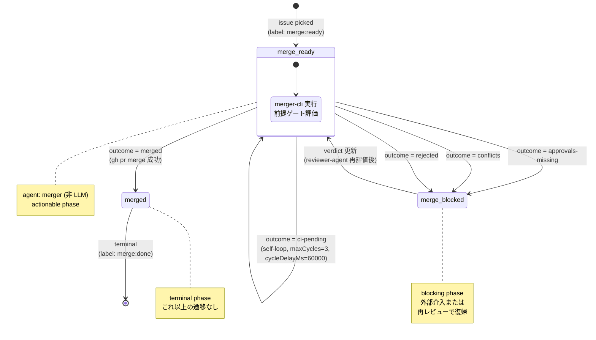
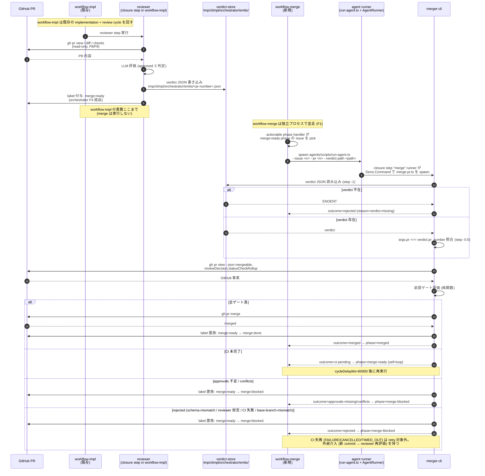
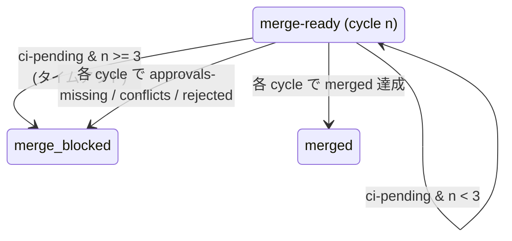

# 04 State Machine — workflow-merge.json

> **Canonical source**: 00-design-decisions.md § T14 (2026-04-13, supersedes T12
> for runner-mediated sequence depiction)。T12 継承: canMerge/mergePr
> responsibility split。T10 継承: outcome/reason/gate 順序。T8 継承: outcome
> 名一覧。Scheduler/Reason/issueStore は T10 + 03-data-flow.md を参照。

## workflow-merge.json の phase 遷移図

**phase の性質**:

| Phase           | 種別       | agent                                             | 進入条件                                                          | 退出条件                                                          |
| --------------- | ---------- | ------------------------------------------------- | ----------------------------------------------------------------- | ----------------------------------------------------------------- |
| `merge-ready`   | actionable | `merger` (merger-cli を起動する非 LLM agent type) | label `merge:ready` 付与 / 既存 `merge-ready` issue が cycle 再開 | merger-cli の verdict outcome 確定                                |
| `merge-blocked` | blocking   | (none)                                            | approvals-missing / conflicts / rejected outcome                  | verdict 更新 (外部 reviewer-agent 再実行) で `merge-ready` に復帰 |
| `merged`        | terminal   | (none)                                            | merged outcome + `gh pr merge` 成功                               | なし (終端)                                                       |

**outcome → phase マッピング** (F4 の既存 phase-transition 機構を使用):

| verdict outcome     | 次 phase                  | 付与ラベル         | 備考                                                                                           |
| ------------------- | ------------------------- | ------------------ | ---------------------------------------------------------------------------------------------- |
| `merged`            | `merged`                  | `merge:done`       | `gh pr merge` 成功後に merger-cli が付与                                                       |
| `ci-pending`        | `merge-ready` (self-loop) | `merge:ready` 維持 | cycleDelayMs 経過後に再評価 (CI QUEUED/IN_PROGRESS/PENDING、または mergeable=UNKNOWN)          |
| `approvals-missing` | `merge-blocked`           | `merge:blocked`    | reviewDecision !== 'APPROVED'                                                                  |
| `conflicts`         | `merge-blocked`           | `merge:blocked`    | mergeable === 'CONFLICTING' (rebase 必要)                                                      |
| `rejected`          | `merge-blocked`           | `merge:blocked`    | schema-mismatch / reviewer 拒否 / CI 失敗 (FAILURE/CANCELLED/TIMED_OUT) / base-branch-mismatch |

## ラベル遷移表

| フェーズ遷移                          | 削除ラベル      | 付与ラベル      | 付与主体                                                                 |
| ------------------------------------- | --------------- | --------------- | ------------------------------------------------------------------------ |
| (外部) approved → merge-ready         | (なし)          | `merge:ready`   | workflow-impl の reviewer closure (orchestrator 既存 label 機構 F4 経由) |
| merge-ready → merged                  | `merge:ready`   | `merge:done`    | merger-cli (gh pr merge 成功直後)                                        |
| merge-ready → merge-blocked           | `merge:ready`   | `merge:blocked` | merger-cli (前提ゲート失敗時: approvals-missing / conflicts / rejected)  |
| merge-blocked → merge-ready           | `merge:blocked` | `merge:ready`   | (手動 or reviewer-agent 再実行) orchestrator 既存機構                    |
| merge-ready → merge-ready (self-loop) | (なし)          | (なし, 維持)    | — (ラベル変更なし、phase のみ再入)                                       |

**名前空間分離** (F2, workflow-merge.json の `labelPrefix: "merge:"` 設定):

- workflow-impl が使うラベル (例: `impl:*` / `review:*`) と完全分離。
- GitHub label として `merge:ready`, `merge:blocked`, `merge:done` の 3
  種のみを新規作成する必要がある。
- 既存の PR label (例: `bug`, `enhancement`)
  とは名前空間が異なるため衝突しない。

## 並走 workflow 間のハンドオフ

**ハンドオフ契約**:

1. **書き込み側の約束 (workflow-impl / reviewer)**:
   - 承認判定時、verdict JSON を
     `tmp/climpt/orchestrator/emits/<pr-number>.json` に **先に書き込んでから**
     `merge:ready` ラベルを付ける (読み手が label を見て verdict 不在になる race
     を回避)。
   - verdict JSON は `03-data-flow.md` のスキーマに準拠。
2. **読み込み側の約束 (workflow-merge orchestrator → agent runner →
   merger-cli)**:
   - orchestrator → `agents/scripts/run-agent.ts` → `AgentRunner` closure step
     runner → `merge-pr.ts` の **4 段 subprocess 呼出** (Amendment T14 Decision
     1)。orchestrator が `merge:ready` phase issue を pick → run-agent.ts を
     subprocess で起動 (`--issue <n> --pr <n> --verdict-path 
`) → AgentRunner
     が `.agent/merger/agent.json` の closure step `"merge"` を dispatch →
     closure runner が `${context.prNumber}` / `${context.verdictPath}` を
     substitute → `merge-pr.ts` を `Deno.Command` で spawn。verdict 不在なら
     `merge-pr.ts` が outcome=`rejected` (reason=`verdict-missing`) を返す (03
     step -1 参照)。
   - **Phase 0 prerequisites** (本設計実装前に climpt runtime
     へ先行追加する新規機能):
     - Phase 0-a: `issue.payload` → `agent.parameters` binding (orchestrator
       dispatcher が payload を展開し run-agent.ts の CLI 引数へ変換)
     - Phase 0-b: `closure.runner.args` template substitution
       (`${context.prNumber}` / `${context.verdictPath}` を agent parameters
       値から解決)
     - Phase 0-c: closure step subprocess runner 定義 (既存 closure step は
       prompt-only、新 kind として subprocess spawn を追加)
     - 詳細は `05-implementation-plan.md` の Phase 0 行を参照。
   - PR 番号は GitHub API から取得。verdict JSON 内の PR
     番号フィールドと照合し、不一致なら reject。実装は `merge-pr.ts` step -0.5
     (`pr-number-mismatch` → `rejected`)、03-data-flow.md 参照。
3. **同一 PR に対する同時実行禁止**:
   - F3 の per-workflow lock は workflow-merge 側の issue-store
     (`.agent/climpt/tmp/issues-merge`) で担保。
   - merger-cli 自体は GitHub 側の状態 (ラベル `merge:done` / PR state)
     を先に確認し、既に merged なら何もせず exit 0。

## maxCycles の根拠

### デフォルト値の決定

| パラメータ       | 推奨値               | 根拠                                                                                                                                                                                                                                             |
| ---------------- | -------------------- | ------------------------------------------------------------------------------------------------------------------------------------------------------------------------------------------------------------------------------------------------ |
| `maxCycles`      | **3**                | CI 待ちの self-loop に許す最大回数。3 回 × 60 秒 = 最大 3 分の待機で CI が完了しない場合、タイムアウトとして `merge-blocked` に遷移させたほうが人間の目で見たほうがよい。climpt CI の典型実行時間は 2 分以内なので、3 cycle は安全マージン込み。 |
| `cycleDelayMs`   | **60000** (60 秒)    | GitHub Actions の status check は通常 30-60 秒でステータス更新される。60 秒間隔なら無駄なポーリングを避けつつ CI 完了を高確率で捕捉できる。                                                                                                      |
| 最大合計待機時間 | 3 × 60s = **180 秒** | これを超えても CI 未完了なら、一時的障害の可能性があるので人間介入 (merge-blocked) に委ねる。                                                                                                                                                    |

### maxCycles 超過時の挙動

- **ci-pending は唯一の retry 対象**。CI 失敗 (FAILURE/CANCELLED/TIMED_OUT) は
  `rejected` outcome にマッピングされ、retry されず即 `merge-blocked` に遷移する
  (無限 retry リスク回避)。
- cycle n=3 で依然 `ci-pending` の場合、merger-cli は **`approvals-missing` /
  `conflicts` / `rejected` のいずれでもない特殊扱い** (CI timeout) として
  `merge-blocked` に遷移させる (label: `merge:blocked`)。
- この時、merger-cli は PR コメントに「CI timeout after 3
  cycles」のような短いメッセージを追加する (PR コメントは gh pr comment
  で実現、boundary bash pattern 非該当で parent process から安全に実行可能)。
- `merge-blocked` からの復帰は reviewer-agent の再実行 (workflow-impl 側で新しい
  commit がされた場合など) に任せる。

### 設計トレードオフ

- **maxCycles を大きく (例: 10)** すると CI 時間が長い PR も自動 merge
  可能だが、トラブル時の無駄なポーリングコストが増える。
- **maxCycles を小さく (例: 1)** すると CI 完了が 1
  分以内に収まらないと毎回人間介入が必要になり、自動化効果が薄れる。
- **3** は「多くの PR は 1-2 cycle で決着、稀に 3 cycle まで許す」という現実的な
  balance。設定可能 (workflow-merge.json の phase 定義内で上書き可)
  にしておき、運用で調整する。

### maxCycles が適用される phase

- `merge-ready` のみ (self-loop 対象)。
- `merge-blocked` は blocking phase なので cycle に含まれず、外部介入 (verdict
  更新) を待つ。
- `merged` は terminal なので cycle 概念なし。

詳細な phase 定義 JSON は `06-workflow-examples.md` の
`.agent/workflow-merge.json` サンプルを参照。
