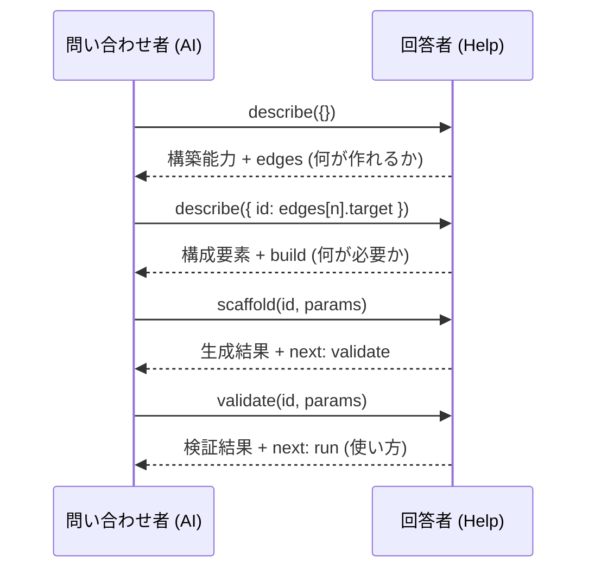
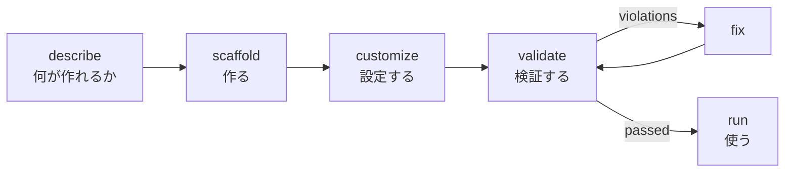
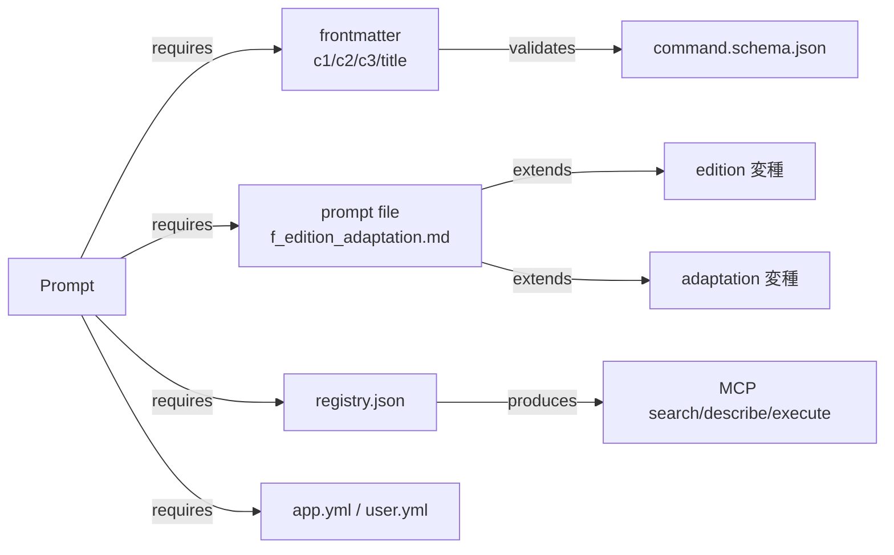
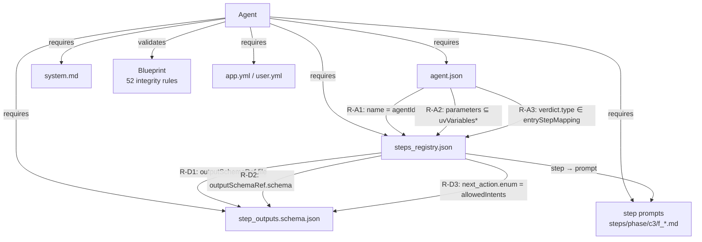
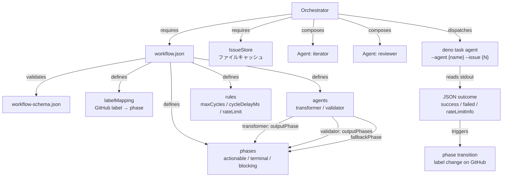
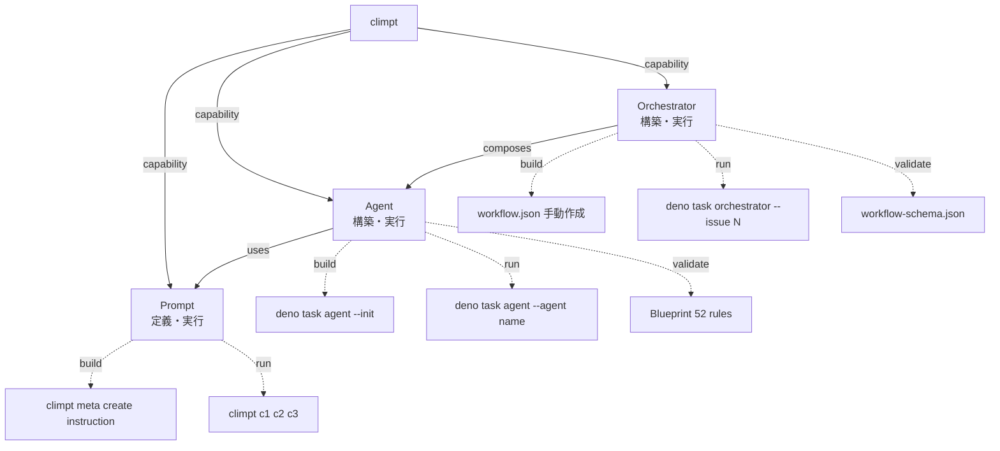
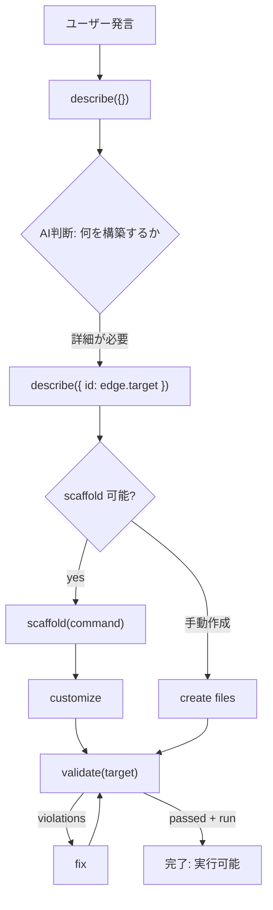

# 統一 Help 概念 v8

## 1. Help は対話プロトコルである

climpt の help は AI が読む構造化データである。 人間は AI
に翻訳させる。人間可読性は設計目標ではない。

help の本質は **問い合わせ者と回答者の間の対話プロトコル** である。



### 言語体系

| 要素         | 役割                                                    |
| ------------ | ------------------------------------------------------- |
| **話者**     | AI エージェント (問い合わせ者)                          |
| **聞き手**   | climpt help システム (回答者)                           |
| **語彙**     | Node ID の集合 — 問える対象                             |
| **動詞**     | `describe` → `scaffold` → `validate` → `run` (この順序) |
| **文法**     | 各レスポンスの edges が次に発話可能な文を定義する       |
| **状態遷移** | Node = 状態、Edge = 遷移、build → run が一方向フロー    |

### 会話規則

1. AI は edges に含まれる target のみを次の問い合わせに使える
2. 各レスポンスは自己完結 — それ単体で行動可能な情報を持つ
3. **build が先、run は後**: run は構築完了後にはじめて提示される
4. 問い合わせのたびに深くなる必要はない — 横にも辿れる

### 1.5. Construction Tree vs Execution Tree

Help が扱う対象は **construction tree** — `.agent/` ディレクトリ構造
(何が作られるか) である。

```
.agent/
├── {domain}/                  — Prompt ドメイン
│   ├── prompts/{c2}/{c3}/     — プロンプトファイル群
│   ├── config/{domain}-steps-app.yml
│   ├── config/{domain}-steps-user.yml
│   └── registry.json
├── {agent-name}/              — Agent 定義
│   ├── agent.json
│   ├── steps_registry.json
│   ├── schemas/step_outputs.schema.json
│   ├── prompts/system.md
│   └── prompts/steps/{phase}/{c3}/f_*.md
└── workflow.json              — Orchestrator 定義
```

**Execution tree** (JSR exports: `./cli`, `./mcp`, `./reg`, `./docs`,
`./agents`, `./agents/runner`, `./agents/orchestrator`)
は、構築済みのものを実行する手段である。

| 階層                                            | 意味   | Help での位置づけ |
| ----------------------------------------------- | ------ | ----------------- |
| Capability (Prompt/Agent/Orchestrator)          | 目的   | help の最上位     |
| Construction artifacts (`.agent/` のファイル群) | 構築物 | help の第2階層    |

- 構築は scaffold コマンドとファイル編集によって行う
- 実行 (JSR exports) は構築 + 検証の後に来る
- **Help は「既存のものを実行する」ユースケースを扱わない** — それは help
  のスコープ外。Help は構築をガイドする。

## 2. 構築から利用への一方向フロー

help は **build → configure → run** の順序で案内する。
「使い方」は構築が完了した結果として提示される。



| フェーズ | 動詞           | AI が見るフィールド                           |
| -------- | -------------- | --------------------------------------------- |
| 1. 把握  | describe       | edges, build.files, build.params, constraints |
| 2. 生成  | scaffold       | ScaffoldResult.command, .created, .next       |
| 3. 設定  | (ファイル編集) | edges.when で変更箇所を特定                   |
| 4. 検証  | validate       | ValidateResult.passed, .violations            |
| 5. 利用  | run            | ValidateResult.run (passed 時のみ)            |

`run` は validate が passed を返した後に初めて Node に付与される。 構築前の Node
には `run` フィールドは存在しない。

## 3. データ構造

型は4つ。

```typescript
interface Node {
  id: string;
  kind: "capability" | "component" | "config";
  description: string;
  /** 構築仕様: 何を作るか (describe で表示) */
  build?: {
    files: string[];
    params: Record<string, string>;
    /** 動的参照の解決に使うコンテキスト値 (constraints の {field} in file path を解決) */
    context?: Record<string, string>;
  };
  /** 実行仕様: validate passed 後に提示 */
  run?: {
    command: string;
    endpoint: string;
    params: Record<string, string>;
    examples: string[];
  };
  /** 利用可能な子要素 (User向け: 選択肢を示す) */
  items?: Item[];
  edges: Edge[];
  /** ファイル間の整合性制約 (describe で表示) */
  constraints?: Constraint[];
  /** 次に取るべきアクション */
  next?: {
    action: "describe" | "scaffold" | "validate";
    target: string;
    params?: Record<string, string>;
  };
}

/** 選択可能な具体要素。動的に生成される (例: .agent/*/agent.json から読み込み) */
interface Item {
  name: string;
  description: string; // agent.json の description から取得
  when: string;        // agent.json の capabilities/actions.types から生成
}

interface Edge {
  rel: "requires" | "produces" | "validates" | "composes";
  target: string;
  label: string;
  /** なぜこの関係を辿るべきか (判断基準) */
  when?: string;
}

interface Constraint {
  rule: string;
  from: { file: string; field: string };
  to: { file: string; field: string };
  operator: ConstraintOperator;
  /** 補足説明 (セマンティクスの注意点など) */
  _note?: string;
}

/** operator の意味定義 */
type ConstraintOperator =
  | "equals"      // from.field の値 === to.field の値 (文字列一致)
  | "contains"    // from.field の集合 ⊇ to.field の集合 (部分集合)
  | "subset_of"   // from.field の集合 ⊆ to.field の集合
  | "maps_to"     // from.field の値が to.field のキーとして存在する
  | "references"  // from.field の値が to.file 内のパス/定義名として解決可能
  | "exists"      // from.field が指すファイルパスが実際に存在する
  | "matches";    // from.field の値が to.field のパターンに一致する

### Field Path 記法

constraints の `field` は以下の記法を使用する:

| 記法 | 意味 | 例 |
|------|------|-----|
| `$.prop` | ルートからのプロパティ | `$.name` |
| `$.a.b.c` | ネストプロパティ | `$.runner.verdict.type` |
| `$.obj.*` | オブジェクトの全キー/値 | `$.steps.*` |
| `$.obj.@key` | オブジェクトの各エントリのキー | `$.steps.@key` (ステップのキー名) |
| `$.obj.*.prop` | 全キー配下のプロパティ | `$.steps.*.stepId` |
| `$[{ref}]` | 同一イテレーションコンテキスト内のフィールド値で解決されるキー | `$[{outputSchemaRef.schema}]` |
| `(file)` | ファイル自体の存在チェック | `to.field` が `(file)` なら exists |
| `<pattern>` | ファイルコンテンツ内のパターン | `<uv-*>` (テンプレート変数) |
| `{field}` in file path | 同一イテレーションコンテキストまたは `build.context` のフィールド値で解決 | `{schemasBase}/{outputSchemaRef.file}` |

/** scaffold レスポンス */
interface ScaffoldResult {
  command: string;
  params: Record<string, string>;
  examples: string[];
  created: string[];       // 実際に生成されたファイル一覧
  next: {
    action: "validate";
    target: string;
    params: Record<string, string>;
  };
}

/** validate レスポンス */
interface ValidateResult {
  passed: string[];
  violations: Violation[];
  /** violations が空の場合のみ存在 */
  run?: {
    command: string;
    endpoint: string;
    params: Record<string, string>;
    examples: string[];
  };
}

interface Violation {
  rule: string;
  message: string;
  fix: string;
}
```

build/run は Node に inline。`items` は利用可能な選択肢を、`Edge.when`
は判断基準を提供する。 AI は `when`
フィールドをユーザーの意図とマッチングし、次のクエリを決定する。

## 4. 初期レスポンス

`describe({})` — 2階層展開。構築能力を示す。`run` は含まない。

```json
{
  "id": "climpt",
  "kind": "capability",
  "description": "CLI + Prompt. プロンプト・エージェント・オーケストレーターを構築するツール",
  "edges": [
    { "rel": "composes", "target": "prompt", "label": "Prompt 構築" },
    { "rel": "composes", "target": "agent", "label": "Agent 構築" },
    {
      "rel": "composes",
      "target": "orchestrator",
      "label": "Orchestrator 構築"
    }
  ],
  "children": [
    {
      "id": "prompt",
      "kind": "capability",
      "description": "C3L (Category-Classification-Criteria) アドレス (c1/c2/c3) でプロンプトを定義する。入力テキストに対してプロンプトを適用し、指示文書を生成する",
      "build": {
        "files": [
          ".agent/{name}/prompts/{c2}/{c3}/f_default.md",
          ".agent/{name}/config/{name}-steps-app.yml",
          ".agent/{name}/config/{name}-steps-user.yml"
        ],
        "params": {
          "name": "ドメイン名 (c1)",
          "c2": "アクション",
          "c3": "ターゲット"
        }
      },
      "edges": [
        {
          "rel": "requires",
          "target": "component:frontmatter",
          "label": "C3L フロントマター — c1/c2/c3/title + options を定義",
          "when": "プロンプトの入出力仕様を定義したいとき"
        },
        {
          "rel": "requires",
          "target": "component:prompt-file",
          "label": "プロンプトファイル — f_{edition}_{adaptation}.md",
          "when": "プロンプト本文を書く・編集したいとき"
        },
        {
          "rel": "requires",
          "target": "config:registry",
          "label": "registry.json — MCP経由の検索に必要",
          "when": "MCP経由でプロンプトを検索可能にしたいとき"
        },
        {
          "rel": "validates",
          "target": "config:command-schema",
          "label": "command.schema.json",
          "when": "フロントマターの記述が正しいか検証したいとき"
        }
      ],
      "next": {
        "action": "scaffold",
        "target": "prompt",
        "params": { "name": "{name}" }
      }
    },
    {
      "id": "agent",
      "kind": "capability",
      "description": "ステップフロー駆動のエージェントを構築する。エージェントは GitHub Issue に対してタスクを自律実行する",
      "build": {
        "files": [
          ".agent/{name}/agent.json",
          ".agent/{name}/steps_registry.json",
          ".agent/{name}/schemas/step_outputs.schema.json",
          ".agent/{name}/prompts/system.md",
          ".agent/{name}/prompts/steps/{phase}/{c3}/f_default.md"
        ],
        "params": { "name": "エージェント名" },
        "context": {
          "schemasBase": ".agent/{name}/schemas",
          "promptsBase": ".agent/{name}/prompts",
          "pathTemplate": "{c2}/{c3}/f_{edition}_{adaptation}.md"
        }
      },
      "edges": [
        {
          "rel": "requires",
          "target": "component:agent-definition",
          "label": "agent.json — 名前・パラメータ・実行フロー・判定方式を定義",
          "when": "エージェントの振る舞いを設計・変更したいとき"
        },
        {
          "rel": "requires",
          "target": "component:step-registry",
          "label": "steps_registry.json — ステップ遷移・構造化出力ゲート・スキーマ参照を定義",
          "when": "ステップフローの遷移ロジックを設計・変更したいとき"
        },
        {
          "rel": "requires",
          "target": "component:step-schema",
          "label": "step_outputs.schema.json — 各ステップの出力JSONスキーマ",
          "when": "ステップ出力の構造を定義・変更したいとき"
        },
        {
          "rel": "requires",
          "target": "component:prompts",
          "label": "prompts/ — system.md + steps/{phase}/{c3}/f_*.md",
          "when": "エージェントの指示内容を書く・編集したいとき"
        },
        {
          "rel": "validates",
          "target": "blueprint:agent",
          "label": "Blueprint — 52整合性ルールで検証",
          "when": "構築・編集後に整合性を確認したいとき"
        }
      ],
      "next": {
        "action": "scaffold",
        "target": "agent",
        "params": { "name": "{name}" }
      }
    },
    {
      "id": "orchestrator",
      "kind": "capability",
      "description": "複数エージェントをワークフローで協調させる。GitHub Issue のラベルで状態遷移し、エージェントを自動ディスパッチする",
      "build": {
        "files": [".agent/workflow.json"],
        "params": {
          "phases": "状態機械: actionable (エージェント実行) / terminal (完了) / blocking (停止)",
          "labelMapping": "GitHub ラベル → phase の対応表",
          "agents": "参加エージェント: transformer (outputPhase) / validator (outputPhases)",
          "rules": "maxCycles (デフォルト5), cycleDelayMs (デフォルト10000)"
        }
      },
      "edges": [
        {
          "rel": "composes",
          "target": "agent",
          "label": "エージェントをディスパッチする",
          "when": "ワークフローに参加するエージェントを構築・確認したいとき"
        },
        {
          "rel": "requires",
          "target": "component:workflow-config",
          "label": "workflow.json — phases, labelMapping, agents, rules を定義",
          "when": "ワークフローの状態遷移・エージェント割当を設計したいとき"
        },
        {
          "rel": "requires",
          "target": "component:issue-store",
          "label": "IssueStore — Issue データのファイルキャッシュ",
          "when": "ローカルテスト用に Issue データを配置したいとき"
        },
        {
          "rel": "validates",
          "target": "config:workflow-schema",
          "label": "workflow-schema.json — 整合性を検証",
          "when": "ワークフロー定義が正しいか検証したいとき"
        }
      ],
      "next": { "action": "describe", "target": "component:workflow-config" }
    }
  ]
}
```

### run の提示タイミング

`run` は初期レスポンスに含まれない。validate が passed を返した後に提示される。

```json
// validate 結果 (passed)
{
  "passed": ["R-A1", "R-A2", "..."],
  "violations": [],
  "run": {
    "command": "deno task agent --agent {name}",
    "params": { "name": "構築したエージェント名", "--issue": "対象Issue番号" },
    "examples": ["deno task agent --agent test-runner --issue 42"]
  }
}
```

構築完了して初めて「使い方」が示される。

## 5. 依存グラフ

### 5.1. Prompt



### 5.2. Agent



### 5.2.1. Agent 構造化 constraints

describe({ id: "agent" }) のレスポンスに含まれる `constraints` フィールド:

```json
[
  {
    "rule": "R-A1",
    "from": { "file": "agent.json", "field": "$.name" },
    "to": { "file": "steps_registry.json", "field": "$.agentId" },
    "operator": "equals"
  },
  {
    "rule": "R-A2",
    "from": { "file": "agent.json", "field": "$.parameters | keys" },
    "to": {
      "file": "steps_registry.json",
      "field": "$.steps.*.uvVariables | flatten | unique"
    },
    "operator": "subset_of",
    "_note": "Every declared parameter must be consumed by at least one step. uvVariables may include runtime-injected values not in parameters."
  },
  {
    "rule": "R-A3",
    "from": { "file": "agent.json", "field": "$.runner.verdict.type" },
    "to": { "file": "steps_registry.json", "field": "$.entryStepMapping" },
    "operator": "maps_to"
  },
  {
    "rule": "R-B1",
    "from": { "file": "steps_registry.json", "field": "$.steps.@key" },
    "to": { "file": "steps_registry.json", "field": "$.steps.*.stepId" },
    "operator": "equals"
  },
  {
    "rule": "R-B5",
    "from": {
      "file": "steps_registry.json",
      "field": "$.steps.*.transitions.*.target"
    },
    "to": { "file": "steps_registry.json", "field": "$.steps" },
    "operator": "maps_to",
    "_note": "target: null is a valid terminal transition and is excluded from maps_to check"
  },
  {
    "rule": "R-D1",
    "from": {
      "file": "steps_registry.json",
      "field": "$.steps.*.outputSchemaRef.file"
    },
    "to": { "file": "{schemasBase}/{outputSchemaRef.file}", "field": "(file)" },
    "operator": "exists"
  },
  {
    "rule": "R-D2",
    "from": {
      "file": "steps_registry.json",
      "field": "$.steps.*.outputSchemaRef.schema"
    },
    "to": { "file": "{schemasBase}/{outputSchemaRef.file}", "field": "$" },
    "operator": "references"
  },
  {
    "rule": "R-D3",
    "from": {
      "file": "steps_registry.json",
      "field": "$.steps.*.structuredGate.allowedIntents"
    },
    "to": {
      "file": "{schemasBase}/{outputSchemaRef.file}",
      "field": "$[{outputSchemaRef.schema}].properties.next_action.properties.action.enum"
    },
    "operator": "equals"
  },
  {
    "rule": "PATH-1",
    "from": { "file": "agent.json", "field": "$.runner.flow.systemPromptPath" },
    "to": { "file": "prompts/system.md", "field": "(file)" },
    "operator": "exists"
  },
  {
    "rule": "TEMPLATE-1",
    "from": {
      "file": "prompts/steps/{c2}/{c3}/f_{edition}_{adaptation}.md",
      "field": "<uv-*>"
    },
    "to": { "file": "steps_registry.json", "field": "$.steps.*.uvVariables" },
    "operator": "contains",
    "_note": "Per-step: c2, c3, edition, adaptation resolved from step definition. pathTemplate defines naming."
  },
  {
    "rule": "TEMPLATE-2",
    "from": { "file": "steps_registry.json", "field": "$.steps.*.uvVariables" },
    "to": {
      "file": "prompts/steps/{c2}/{c3}/f_{edition}_{adaptation}.md",
      "field": "<uv-*>"
    },
    "operator": "contains",
    "_note": "Per-step: each step's c2, c3, edition, adaptation resolve the prompt file path."
  }
]
```

上記は describe レスポンスに含まれる代表的制約。全52ルール (R-A1〜R-F20) +
PATH/TEMPLATE ルールは
`agents/docs/builder/reference/blueprint/02-integrity-rules.md`
に完全定義されている。

constraints は5ファイル全てをカバーする:

| ファイル                                              | カバーするルール                                                                                                                 |
| ----------------------------------------------------- | -------------------------------------------------------------------------------------------------------------------------------- |
| agent.json                                            | R-A1 (`$.name`), R-A2 (`$.parameters \| keys`), R-A3 (`$.runner.verdict.type`), PATH-1 (`$.runner.flow.systemPromptPath`)        |
| steps_registry.json                                   | R-A1~A3 (to), R-B1 (`$.steps.@key`), R-B5 (`$.steps.*.transitions.*.target`), R-D1~D3 (from), TEMPLATE-1 (to), TEMPLATE-2 (from) |
| {schemasBase}/{outputSchemaRef.file}                  | R-D1~D3 (to)                                                                                                                     |
| prompts/system.md                                     | PATH-1 (to)                                                                                                                      |
| prompts/steps/{c2}/{c3}/f\_{edition}\_{adaptation}.md | TEMPLATE-1 (from `<uv-*>`), TEMPLATE-2 (to `<uv-*>`)                                                                             |

Mermaid グラフは人間向けの視覚表現。AI は `constraints` 配列を直接消費する。

### 5.3. Orchestrator



### 5.4. 全体構造



## 6. 対話プロトコルの詳細

### 6.1. describe(query) — 構造を問う

AI が発話できる唯一の「質問」。レスポンスの edges が次の語彙を定義する。

```
describe({})                                → 全体 (2階層)
describe({ id: "agent" })                  → Agent の全コンポーネント + constraints
describe({ id: "orchestrator" })           → Orchestrator の全コンポーネント + constraints
describe({ id: "component:step-registry" }) → steps_registry の詳細 + 依存先
describe({ id: "component:workflow-config" }) → workflow.json の構造 + 依存先
```

### 6.2. scaffold(id, params) — 構築する (Developer)

edges に `produces` がある Node で発話可能。レスポンスに `next` (次にすべきこと)
が含まれる。

```
scaffold("prompt", { name: "git", c2: "review", c3: "diff" })
→ {
    "command": "climpt meta create instruction",
    "params": { "name": "git", "c2": "review", "c3": "diff" },
    "examples": ["echo '要件文' | climpt meta create instruction -o .agent/git/prompts/review/diff/f_default.md"],
    "created": [
      ".agent/git/prompts/review/diff/f_default.md",
      ".agent/git/config/git-steps-app.yml",
      ".agent/git/config/git-steps-user.yml"
    ],
    "next": { "action": "validate", "target": "prompt", "params": { "name": "git" } }
  }

scaffold("agent", { name: "my-agent" })
→ {
    "command": "deno task agent --init --agent my-agent",
    "params": { "name": "my-agent" },
    "examples": ["deno task agent --init --agent test-runner"],
    "created": [
      ".agent/my-agent/agent.json",
      ".agent/my-agent/steps_registry.json",
      ".agent/my-agent/schemas/step_outputs.schema.json",
      ".agent/my-agent/prompts/system.md",
      ".agent/my-agent/prompts/steps/initial/manual/f_default.md",
      ".agent/my-agent/prompts/steps/continuation/manual/f_default.md"
    ],
    "next": { "action": "validate", "target": "agent", "params": { "name": "my-agent" } }
  }

(orchestrator の scaffold は未実装。workflow.json は手動作成)
```

### 6.3. validate(id, params) — 検証する (Developer)

scaffold 後、または編集後に発話する。

```
validate("agent", { name: "my-agent" })
  → { passed: ["R-A1", ...], violations: [] }

validate("agent", { name: "broken-agent" })
  → { violations: [
       { rule: "R-A1",
         message: "agent.name 'broken-agent' != registry.agentId 'old-name'",
         fix: "steps_registry.json の agentId を 'broken-agent' に変更" }
     ] }

validate("orchestrator", { workflow: ".agent/workflow.json" })
  → { passed: [...], violations: [
       { rule: "phase-ref",
         message: "agents.iterator.outputPhase 'review' が phases に未定義",
         fix: "phases に 'review' を追加するか outputPhase を既存 phase に変更" }
     ] }
```

### 6.4. run(command) — 実行する (User)

Node の `run` フィールドに記載されたコマンドを実行する。

```
run("climpt git group-commit unstaged-changes")
run("deno task agent --agent iterator --issue 123")
run("deno task orchestrator --issue 123 --dry-run")
```

### 6.5. 対話ストーリー

---

#### Story 3: Developer — 「新しいエージェントを作りたい」

ユーザーの発言: 「テストを自動実行するエージェントを作って」

**Turn 1: AI が全体を把握する**

```json
// AI → Help
{ "action": "describe", "query": {} }
```

AI の判断: 新しいエージェント構築 → `agent` の `build` が適合。
まず構成ファイルの詳細を知りたい。

**Turn 2: AI が Agent の構成を深掘りする**

```json
// AI → Help
{ "action": "describe", "query": { "id": "agent" } }
```

```json
// Help → AI
{
  "id": "agent",
  "kind": "capability",
  "description": "ステップフロー駆動のエージェントを構築・実行する",
  "build": {
    "files": [
      ".agent/{name}/agent.json",
      ".agent/{name}/steps_registry.json",
      ".agent/{name}/schemas/step_outputs.schema.json",
      ".agent/{name}/prompts/system.md",
      ".agent/{name}/prompts/steps/{phase}/{c3}/f_default.md"
    ],
    "params": { "name": "エージェント名" },
    "context": {
      "schemasBase": ".agent/{name}/schemas",
      "promptsBase": ".agent/{name}/prompts",
      "pathTemplate": "{c2}/{c3}/f_{edition}_{adaptation}.md"
    }
  },
  "edges": [
    {
      "rel": "requires",
      "target": "component:agent-definition",
      "label": "agent.json"
    },
    {
      "rel": "requires",
      "target": "component:step-registry",
      "label": "steps_registry.json"
    },
    {
      "rel": "requires",
      "target": "component:step-schema",
      "label": "step_outputs.schema.json"
    },
    { "rel": "requires", "target": "component:prompts", "label": "prompts/" },
    {
      "rel": "validates",
      "target": "blueprint:agent",
      "label": "Blueprint (52 integrity rules)"
    }
  ],
  "constraints": [
    {
      "rule": "R-A1",
      "from": { "file": "agent.json", "field": "$.name" },
      "to": { "file": "steps_registry.json", "field": "$.agentId" },
      "operator": "equals"
    },
    {
      "rule": "R-A2",
      "from": { "file": "agent.json", "field": "$.parameters | keys" },
      "to": {
        "file": "steps_registry.json",
        "field": "$.steps.*.uvVariables | flatten | unique"
      },
      "operator": "subset_of",
      "_note": "Every declared parameter must be consumed by at least one step. uvVariables may include runtime-injected values not in parameters."
    },
    {
      "rule": "R-A3",
      "from": { "file": "agent.json", "field": "$.runner.verdict.type" },
      "to": { "file": "steps_registry.json", "field": "$.entryStepMapping" },
      "operator": "maps_to"
    },
    {
      "rule": "R-B1",
      "from": { "file": "steps_registry.json", "field": "$.steps.@key" },
      "to": { "file": "steps_registry.json", "field": "$.steps.*.stepId" },
      "operator": "equals"
    },
    {
      "rule": "R-B5",
      "from": {
        "file": "steps_registry.json",
        "field": "$.steps.*.transitions.*.target"
      },
      "to": { "file": "steps_registry.json", "field": "$.steps" },
      "operator": "maps_to",
      "_note": "target: null is a valid terminal transition and is excluded from maps_to check"
    },
    {
      "rule": "R-D1",
      "from": {
        "file": "steps_registry.json",
        "field": "$.steps.*.outputSchemaRef.file"
      },
      "to": {
        "file": "{schemasBase}/{outputSchemaRef.file}",
        "field": "(file)"
      },
      "operator": "exists"
    },
    {
      "rule": "R-D2",
      "from": {
        "file": "steps_registry.json",
        "field": "$.steps.*.outputSchemaRef.schema"
      },
      "to": { "file": "{schemasBase}/{outputSchemaRef.file}", "field": "$" },
      "operator": "references"
    },
    {
      "rule": "R-D3",
      "from": {
        "file": "steps_registry.json",
        "field": "$.steps.*.structuredGate.allowedIntents"
      },
      "to": {
        "file": "{schemasBase}/{outputSchemaRef.file}",
        "field": "$[{outputSchemaRef.schema}].properties.next_action.properties.action.enum"
      },
      "operator": "equals"
    },
    {
      "rule": "PATH-1",
      "from": {
        "file": "agent.json",
        "field": "$.runner.flow.systemPromptPath"
      },
      "to": { "file": "prompts/system.md", "field": "(file)" },
      "operator": "exists"
    },
    {
      "rule": "TEMPLATE-1",
      "from": {
        "file": "prompts/steps/{c2}/{c3}/f_{edition}_{adaptation}.md",
        "field": "<uv-*>"
      },
      "to": { "file": "steps_registry.json", "field": "$.steps.*.uvVariables" },
      "operator": "contains",
      "_note": "Per-step: c2, c3, edition, adaptation resolved from step definition. pathTemplate defines naming."
    },
    {
      "rule": "TEMPLATE-2",
      "from": {
        "file": "steps_registry.json",
        "field": "$.steps.*.uvVariables"
      },
      "to": {
        "file": "prompts/steps/{c2}/{c3}/f_{edition}_{adaptation}.md",
        "field": "<uv-*>"
      },
      "operator": "contains",
      "_note": "Per-step: each step's c2, c3, edition, adaptation resolve the prompt file path."
    }
  ],
  "next": {
    "action": "scaffold",
    "target": "agent",
    "params": { "name": "{name}" }
  }
}
```

AI の判断: 5ファイルが必要。scaffold コマンドで一括生成できる。

**Turn 3: AI が scaffold を実行する**

```json
// AI → Help
{ "action": "scaffold", "id": "agent", "params": { "name": "test-runner" } }
```

```json
// scaffold 結果 (ScaffoldResult)
{
  "command": "deno task agent --init --agent test-runner",
  "params": { "name": "test-runner" },
  "examples": ["deno task agent --init --agent test-runner"],
  "created": [
    ".agent/test-runner/agent.json",
    ".agent/test-runner/steps_registry.json",
    ".agent/test-runner/schemas/step_outputs.schema.json",
    ".agent/test-runner/prompts/system.md",
    ".agent/test-runner/prompts/steps/initial/manual/f_default.md",
    ".agent/test-runner/prompts/steps/continuation/manual/f_default.md"
  ],
  "next": {
    "action": "validate",
    "target": "agent",
    "params": { "name": "test-runner" }
  }
}
```

**Turn 4: AI がファイルをカスタマイズする**

AI は生成された agent.json を編集:

- `description` を「テスト自動実行エージェント」に変更
- `parameters` に `target` (テスト対象パス) を追加
- `runner.verdict.type` を `detect:structured` に変更

AI は system.md を編集:

- テスト実行の指示プロンプトを記述

AI は step prompts を編集:

- initial ステップ: テスト対象の分析
- continuation ステップ: テスト実行と結果評価

**Turn 5: AI が検証する**

```json
// AI → Help
{
  "action": "validate",
  "query": { "target": "agent", "params": { "name": "test-runner" } }
}
```

```json
// Help → AI
{
  "passed": ["R-A1", "R-B1", "R-B2", "R-D1", "R-D2"],
  "violations": [
    {
      "rule": "R-A3",
      "message": "agent.runner.verdict.type 'detect:structured' が steps_registry.entryStepMapping に未定義。entryStepMapping のキーは ['detect:keyword']",
      "fix": "steps_registry.json の entryStepMapping に 'detect:structured' キーを追加し、エントリーステップを指定"
    },
    {
      "rule": "R-A2",
      "message": "agent.parameters に 'target' が宣言されているが、steps_registry のどの step の uvVariables にも含まれていない",
      "fix": "target を使用する step の uvVariables に 'target' を追加"
    }
  ]
}
```

**Turn 6: AI が修正する**

AI は violations の fix に従い:

1. steps_registry.json の `entryStepMapping` に `"detect:structured"` を追加
2. initial ステップの `uvVariables` に `"target"` を追加

**Turn 7: AI が再検証する**

```json
// AI → Help
{
  "action": "validate",
  "query": { "target": "agent", "params": { "name": "test-runner" } }
}
```

```json
// Help → AI
{
  "passed": ["R-A1", "R-A2", "R-A3", "R-B1", "R-B2", "R-D1", "R-D2", "R-D3"],
  "violations": []
}
```

構築完了。7ターン: describe(2) → scaffold(1) → customize → validate(1) → fix →
validate(1)

---

#### Story 4: Developer — 「ワークフローを構築したい」

ユーザーの発言: 「test-runner と reviewer を連携させるワークフローを作って」

**Turn 1: AI が全体を把握する**

```json
// AI → Help
{ "action": "describe", "query": {} }
```

AI の判断: 複数エージェントの協調 → `orchestrator` が適合。

**Turn 2: AI が Orchestrator の構成を深掘りする**

```json
// AI → Help
{ "action": "describe", "query": { "id": "orchestrator" } }
```

```json
// Help → AI
{
  "id": "orchestrator",
  "kind": "capability",
  "description": "複数エージェントをワークフローで協調させる。GitHub Issue のラベルで状態遷移し、エージェントを自動ディスパッチする",
  "build": {
    "files": [".agent/workflow.json"],
    "params": {}
  },
  "edges": [
    {
      "rel": "composes",
      "target": "agent",
      "label": "エージェントをディスパッチする"
    },
    {
      "rel": "requires",
      "target": "component:workflow-config",
      "label": "workflow.json"
    },
    {
      "rel": "requires",
      "target": "component:issue-store",
      "label": "IssueStore"
    },
    {
      "rel": "validates",
      "target": "config:workflow-schema",
      "label": "workflow-schema.json"
    }
  ],
  "next": { "action": "describe", "target": "component:workflow-config" }
}
```

AI の判断: workflow.json を手動作成する必要がある。 edges に
`component:workflow-config` がある → 構造を深掘り。

**Turn 3: AI が workflow.json の構造を問う**

```json
// AI → Help
{ "action": "describe", "query": { "id": "component:workflow-config" } }
```

```json
// Help → AI
{
  "id": "component:workflow-config",
  "kind": "component",
  "description": "ワークフロー定義。phases (状態機械), labelMapping (GitHub label → phase), agents (transformer/validator), rules (maxCycles, rateLimit)",
  "build": {
    "files": [".agent/workflow.json"],
    "command": "(手動作成)",
    "params": {
      "phases": "状態定義: actionable (エージェント実行) / terminal (完了) / blocking (停止)",
      "labelMapping": "GitHub ラベルから phase への対応表",
      "agents": "エージェント定義: transformer (outputPhase) / validator (outputPhases)",
      "rules": "maxCycles (デフォルト5), cycleDelayMs (デフォルト10000)"
    }
  },
  "edges": [
    {
      "rel": "composes",
      "target": "agent",
      "label": "agents フィールドがエージェントを参照"
    },
    {
      "rel": "validates",
      "target": "config:workflow-schema",
      "label": "workflow-schema.json"
    }
  ]
}
```

**Turn 4: AI が workflow.json を作成する**

AI は component:workflow-config の情報と graph から workflow.json を構築:

```json
{
  "version": "1.0.0",
  "phases": {
    "testing": { "type": "actionable", "priority": 1, "agent": "test-runner" },
    "review": { "type": "actionable", "priority": 2, "agent": "reviewer" },
    "fix": { "type": "actionable", "priority": 3, "agent": "test-runner" },
    "complete": { "type": "terminal" },
    "blocked": { "type": "blocking" }
  },
  "labelMapping": {
    "ready": "testing",
    "test-passed": "review",
    "test-failed": "fix",
    "approved": "complete",
    "blocked": "blocked"
  },
  "agents": {
    "test-runner": {
      "role": "transformer",
      "outputPhase": "review",
      "fallbackPhase": "blocked"
    },
    "reviewer": {
      "role": "validator",
      "outputPhases": { "approved": "complete", "rejected": "fix" },
      "fallbackPhase": "blocked"
    }
  },
  "rules": { "maxCycles": 5, "cycleDelayMs": 10000 }
}
```

**Turn 5: AI が検証する**

```json
// AI → Help
{
  "action": "validate",
  "query": {
    "target": "orchestrator",
    "params": { "workflow": ".agent/workflow.json" }
  }
}
```

```json
// Help → AI
{
  "passed": [
    "version",
    "phase-types",
    "label-mapping",
    "agent-roles",
    "transition-refs",
    "rules-bounds"
  ],
  "violations": []
}
```

**Turn 6: AI が dry-run で動作確認する**

```bash
deno task orchestrator --issue 42 --dry-run --verbose
```

```
[orchestrator] Loading workflow: .agent/workflow.json
[orchestrator] Issue #42: label=ready → phase=testing → agent=test-runner
[orchestrator] DRY-RUN: would dispatch: deno task agent --agent test-runner --issue 42
[orchestrator] DRY-RUN: on success → label change: ready → test-passed → phase=review
```

構築完了。6ターン: describe(3) → create workflow → validate(1) → dry-run

---

#### プロトコル対話パターンまとめ



| ペルソナ                  | 典型パターン                                                | ターン数 |
| ------------------------- | ----------------------------------------------------------- | -------- |
| Developer (scaffold あり) | describe → describe → scaffold → customize → validate → run | 5-7      |
| Developer (手動作成)      | describe → describe → describe → create → validate → run    | 5-7      |

## 7. 反ハルシネーション特性

- AI は edges の target のみで遷移する (語彙制約)
- scaffold は build.files で宣言されたファイルのみ生成する
- validate は Blueprint / workflow-schema の明示的ルールのみで検証する
- run は run.command + params で制約される
- 存在しないコマンド・パラメータを発明できない

## 8. 実装方針

### 8.1. 型定義

src/mcp/types.ts に Node, Edge を追加 (build/run は inline)。

### 8.2. 構造化 constraints

Section 5.2.1 の constraints を Node.constraints フィールドとして格納する。 AI
はこれを直接消費してファイル間整合性を理解する。 人間に見せる場合は AI が
Mermaid グラフにレンダリングする。

constraints は代表的ルールのみ含む。全ルール一覧は
`agents/docs/builder/reference/blueprint/02-integrity-rules.md` を参照。

### 8.3. 実装場所

| 操作               | 実装場所             | 既存コード                       | JSR endpoint                          |
| ------------------ | -------------------- | -------------------------------- | ------------------------------------- |
| describe()         | src/mcp/index.ts     | search + describe ハンドラを統合 | @aidevtool/climpt/mcp                 |
| scaffold()         | agents/init.ts       | 既存 --init を維持               | @aidevtool/climpt/agents (initAgent)  |
| validate()         | agents/config/mod.ts | 既存 validateFull() を公開       | @aidevtool/climpt/agents              |
| run (Prompt)       | (CLI実行)            | climpt c1 c2 c3                  | @aidevtool/climpt/cli                 |
| run (Agent)        | (CLI実行)            | deno task agent --agent name     | @aidevtool/climpt/agents/runner       |
| run (Orchestrator) | (CLI実行)            | deno task orchestrator           | @aidevtool/climpt/agents/orchestrator |

### 8.4. 段階的統合

1. Node 型定義 + 静的グラフ (3 capability + Mermaid)
2. describe() の2階層レスポンス + scaffold() の ScaffoldResult
3. validate() の violations 具体例付きレスポンス
4. CLI showHelp() を describe({}) のテキストレンダリングに置換
