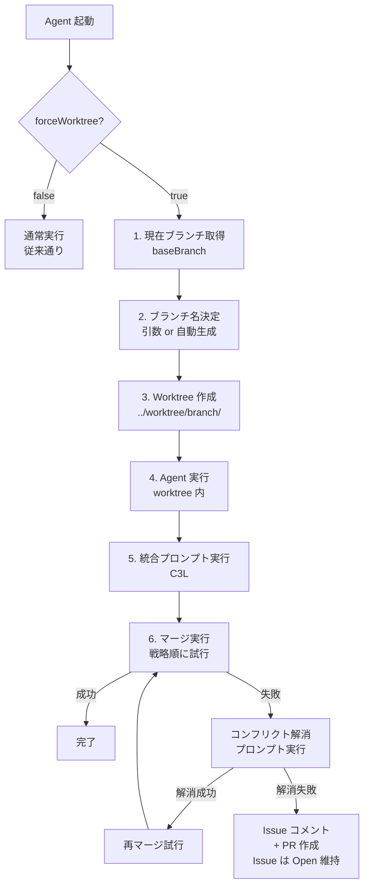
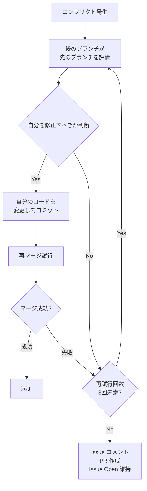

# Worktree 統合設計書

## 概要

agent/iterator と agent/reviewer に共通の worktree 機能を追加する。 Git worktree
を使用して独立した作業ディレクトリで agent を実行し、
完了後に派生元ブランチへ統合する。

## 要件一覧

| #  | 要件                    | 詳細                                                          |
| -- | ----------------------- | ------------------------------------------------------------- |
| 1  | ブランチ名引数          | `--branch` オプションで git ブランチ名を指定可能にする        |
| 2  | force worktree 設定     | config に `forceWorktree: boolean` を追加                     |
| 3  | 引数有効条件            | `forceWorktree: true` のときのみ `--branch` 引数が有効        |
| 4  | worktree 展開タイミング | issue 取得等の前、最初に worktree を展開                      |
| 5  | worktree ブランチ名     | 引数で渡されたブランチ名を使用                                |
| 6  | worktree ルート         | 設定で指定。デフォルト: `../worktree` (相対パス)              |
| 7  | 実際のパス              | `<worktreeRoot>/<ブランチ名>/`                                |
| 8  | 自動ブランチ名          | 引数なし時: `<現在ブランチ>-yyyymmdd-hhmmss`                  |
| 9  | 完了時統合              | agent 完了後、派生元ブランチへ統合                            |
| 10 | 派生元                  | 実行時のカレントブランチ                                      |
| 11 | 派生元オプション        | `--base-branch` で明示指定可能                                |
| 12 | 統合プロンプト          | C3L で各 agent 独自に持つ (共通ではない)                      |
| 13 | merge 順序              | iterator: squash → ff → merge / reviewer: ff → squash → merge |
| 14 | 統合失敗時              | プロンプトで判断手順を記載                                    |

---

## Agent 実行フロー



---

## 型定義

### WorktreeConfig

```typescript
interface WorktreeConfig {
  /**
   * worktree モード有効化
   * true: --branch オプションが有効、worktree で作業
   * false: 通常モード、現在のディレクトリで作業
   */
  forceWorktree: boolean;

  /**
   * worktree のルートディレクトリ
   * 作業リポジトリからの相対パス
   * @default "../worktree"
   */
  worktreeRoot: string;
}
```

### WorktreeSetupResult

```typescript
interface WorktreeSetupResult {
  /** worktree のフルパス */
  worktreePath: string;

  /** 作業ブランチ名 */
  branchName: string;

  /** 派生元ブランチ名 */
  baseBranch: string;

  /** 新規作成されたか */
  created: boolean;
}
```

### MergeStrategy / MergeResult

```typescript
type MergeStrategy = "squash" | "fast-forward" | "merge-commit";

interface MergeResult {
  success: boolean;
  strategy: MergeStrategy;
  error?: string;
  conflictFiles?: string[];
}
```

---

## CLI オプション

| オプション      | 短縮 | 型     | 説明                       |
| --------------- | ---- | ------ | -------------------------- |
| `--branch`      | `-b` | string | 作業ブランチ名             |
| `--base-branch` | なし | string | 派生元 (統合先) ブランチ名 |

---

## マージ戦略

### Iterator (変更が多い)

1. **squash** - 全コミットを1つにまとめる
2. **fast-forward** - 可能なら線形履歴
3. **merge-commit** - 標準マージ

### Reviewer (変更が少ない)

1. **fast-forward** - 線形履歴優先
2. **squash** - 必要ならまとめる
3. **merge-commit** - 標準マージ

---

## 統合失敗時の処理



### コンフリクト解消の原則

1. **後のものが先のものを評価**
   - 作業ブランチ (後) は派生元ブランチ (先) の変更を評価
   - 派生元の変更が正しければ、自分のコードを修正

2. **自己修正優先**
   - コンフリクト箇所では、自分のコードを派生元に合わせる方向で解消
   - ただし、新機能の追加部分は保持

3. **再試行上限**
   - コンフリクト解消は最大 3 回まで試行
   - 3 回失敗したら諦めて PR 作成

4. **諦める場合の手順**
   - Issue に状況説明コメントを追加
   - PR を作成して関連づけ
   - Issue は Open のまま終了
   - 人間によるマニュアル解消を待つ

---

## ログ出力

### ログ出力先

Agent のログは、worktree モードに関わらず、常に**メインリポジトリ**の
`tmp/logs/` ディレクトリに出力されます。

```
# メインリポジトリ
your-project/
├── tmp/logs/agents/{agent-name}/
│   └── session-*.jsonl      ← すべてのログはここに出力
│
# Worktree（ログなし）
../worktree/{branch-name}/
└── (作業ファイルのみ)
```

### 設計理由

| 課題                       | 解決策                                   |
| -------------------------- | ---------------------------------------- |
| 一元管理                   | 実行モードに関わらず同一場所にログを保存 |
| git クリーンネス           | worktree はコミット用にクリーン維持      |
| クリーンアップ後のアクセス | worktree 削除後もログは残存              |
| 重複防止                   | セッションごとに1つのログファイル        |

### gitignore 設定

`tmp/` と worktree ディレクトリは git から除外されています：

```gitignore
# ログディレクトリ
tmp/
tmp/*

# Worktree ディレクトリ
/worktree-*
/worktree-*/
```

---

## 設定例

```json
{
  "version": "1.0.0",
  "agents": { ... },
  "worktree": {
    "forceWorktree": true,
    "worktreeRoot": "../worktree"
  }
}
```

---

## 使用例

```bash
# Worktree モードで Iterator 実行
deno run -A jsr:@aidevtool/climpt/agents/iterator \
  --issue 123 \
  --branch feature/issue-123

# 自動ブランチ名で実行 (現在ブランチ名 + タイムスタンプ)
deno run -A jsr:@aidevtool/climpt/agents/iterator \
  --issue 123
# → ブランチ名: develop-20260105-143022

# 派生元を明示指定
deno run -A jsr:@aidevtool/climpt/agents/iterator \
  --issue 123 \
  --branch feature/issue-123 \
  --base-branch main
```

---

## 関連ファイル

### 新規作成予定

| ファイル                    | 説明                        |
| --------------------------- | --------------------------- |
| `agents/common/worktree.ts` | Worktree 操作ユーティリティ |
| `agents/common/merge.ts`    | マージ操作ユーティリティ    |

### 修正予定

| ファイル                           | 変更内容                         |
| ---------------------------------- | -------------------------------- |
| `agents/common/types.ts`           | `WorktreeConfig` 型追加          |
| `agents/iterator/scripts/cli.ts`   | `--branch`, `--base-branch` 追加 |
| `agents/iterator/scripts/agent.ts` | Worktree 統合処理追加            |
| `agents/reviewer/scripts/cli.ts`   | `--branch`, `--base-branch` 追加 |
| `agents/reviewer/scripts/agent.ts` | Worktree 統合処理追加            |
