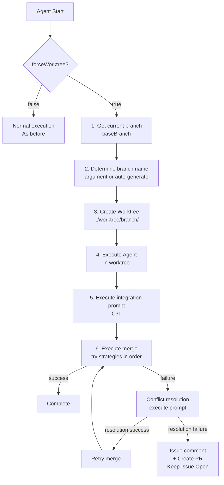
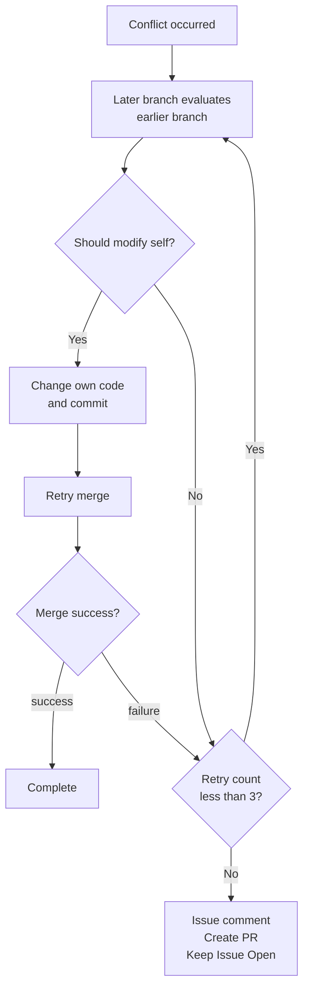

# Worktree Integration Design Document

## Overview

Add common worktree functionality to agent/iterator and agent/reviewer. Execute
agents in an independent working directory using Git worktree, then integrate
into the source branch upon completion.

## Requirements List

| #  | Requirement               | Details                                                       |
| -- | ------------------------- | ------------------------------------------------------------- |
| 1  | Branch name argument      | Enable git branch name specification with `--branch` option   |
| 2  | force worktree setting    | Add `forceWorktree: boolean` to config                        |
| 3  | Argument validity         | `--branch` argument only valid when `forceWorktree: true`     |
| 4  | worktree expansion timing | Expand worktree first, before issue retrieval etc.            |
| 5  | worktree branch name      | Use branch name passed as argument                            |
| 6  | worktree root             | Specified in settings. Default: `../worktree` (relative path) |
| 7  | Actual path               | `<worktreeRoot>/<branch-name>/`                               |
| 8  | Auto branch name          | Without argument: `<current-branch>-yyyymmdd-hhmmss`          |
| 9  | Completion integration    | Integrate into source branch after agent completion           |
| 10 | Source branch             | Current branch at execution time                              |
| 11 | Source branch option      | Can be explicitly specified with `--base-branch`              |
| 12 | Integration prompt        | Each agent has its own via C3L (not shared)                   |
| 13 | Merge order               | iterator: squash → ff → merge / reviewer: ff → squash → merge |
| 14 | Integration failure       | Decision procedure described in prompt                        |

---

## Agent Execution Flow



---

## Type Definitions

### WorktreeConfig

```typescript
interface WorktreeConfig {
  /**
   * Enable worktree mode
   * true: --branch option is valid, work in worktree
   * false: Normal mode, work in current directory
   */
  forceWorktree: boolean;

  /**
   * worktree root directory
   * Relative path from working repository
   * @default "../worktree"
   */
  worktreeRoot: string;
}
```

### WorktreeSetupResult

```typescript
interface WorktreeSetupResult {
  /** Full path of worktree */
  worktreePath: string;

  /** Working branch name */
  branchName: string;

  /** Source branch name */
  baseBranch: string;

  /** Whether newly created */
  created: boolean;
}
```

### MergeStrategy / MergeResult

```typescript
type MergeStrategy = "squash" | "fast-forward" | "merge-commit";

interface MergeResult {
  success: boolean;
  strategy: MergeStrategy;
  error?: string;
  conflictFiles?: string[];
}
```

---

## CLI Options

| Option          | Short | Type   | Description                 |
| --------------- | ----- | ------ | --------------------------- |
| `--branch`      | `-b`  | string | Working branch name         |
| `--base-branch` | none  | string | Source (integration) branch |

---

## Merge Strategies

### Iterator (many changes)

1. **squash** - Combine all commits into one
2. **fast-forward** - Linear history if possible
3. **merge-commit** - Standard merge

### Reviewer (few changes)

1. **fast-forward** - Prioritize linear history
2. **squash** - Combine if necessary
3. **merge-commit** - Standard merge

---

## Integration Failure Handling



### Conflict Resolution Principles

1. **Later evaluates earlier**
   - Working branch (later) evaluates source branch (earlier) changes
   - If source changes are correct, modify own code

2. **Self-modification priority**
   - At conflict points, resolve by aligning own code to source
   - However, preserve new feature additions

3. **Retry limit**
   - Conflict resolution attempted up to 3 times
   - After 3 failures, give up and create PR

4. **Giving up procedure**
   - Add situation explanation comment to Issue
   - Create and link PR
   - End with Issue still Open
   - Wait for manual resolution by human

---

## Log Output

### Log Location

Agent logs are always written to the **main repository's** `tmp/logs/`
directory, regardless of worktree mode.

```
# Main repository
your-project/
├── tmp/logs/agents/{agent-name}/
│   └── session-*.jsonl      ← All logs written here
│
# Worktree (no logs here)
../worktree/{branch-name}/
└── (work files only)
```

### Rationale

| Concern             | Solution                                     |
| ------------------- | -------------------------------------------- |
| Centralized access  | Logs in one location for all execution modes |
| Git cleanliness     | Worktree stays clean for commits             |
| Post-cleanup access | Logs persist after worktree removal          |
| No duplication      | Single log per session                       |

### gitignore Configuration

Both `tmp/` and worktree directories are excluded from git:

```gitignore
# Log directory
tmp/
tmp/*

# Worktree directories
/worktree-*
/worktree-*/
```

---

## Configuration Example

```json
{
  "version": "1.0.0",
  "agents": { ... },
  "worktree": {
    "forceWorktree": true,
    "worktreeRoot": "../worktree"
  }
}
```

---

## Usage Examples

```bash
# Execute Iterator in Worktree mode
deno run -A jsr:@aidevtool/climpt/agents/iterator \
  --issue 123 \
  --branch feature/issue-123

# Execute with auto branch name (current branch name + timestamp)
deno run -A jsr:@aidevtool/climpt/agents/iterator \
  --issue 123
# → Branch name: develop-20260105-143022

# Explicitly specify source branch
deno run -A jsr:@aidevtool/climpt/agents/iterator \
  --issue 123 \
  --branch feature/issue-123 \
  --base-branch main
```

---

## Related Files

### Planned New Files

| File                        | Description                  |
| --------------------------- | ---------------------------- |
| `agents/common/worktree.ts` | Worktree operation utilities |
| `agents/common/merge.ts`    | Merge operation utilities    |

### Planned Modifications

| File                             | Change Content                  |
| -------------------------------- | ------------------------------- |
| `agents/common/types.ts`         | Add `WorktreeConfig` type       |
| `agents/iterator/scripts/cli.ts` | Add `--branch`, `--base-branch` |
| `agents/scripts/run-agent.ts`    | Add Worktree integration logic  |
