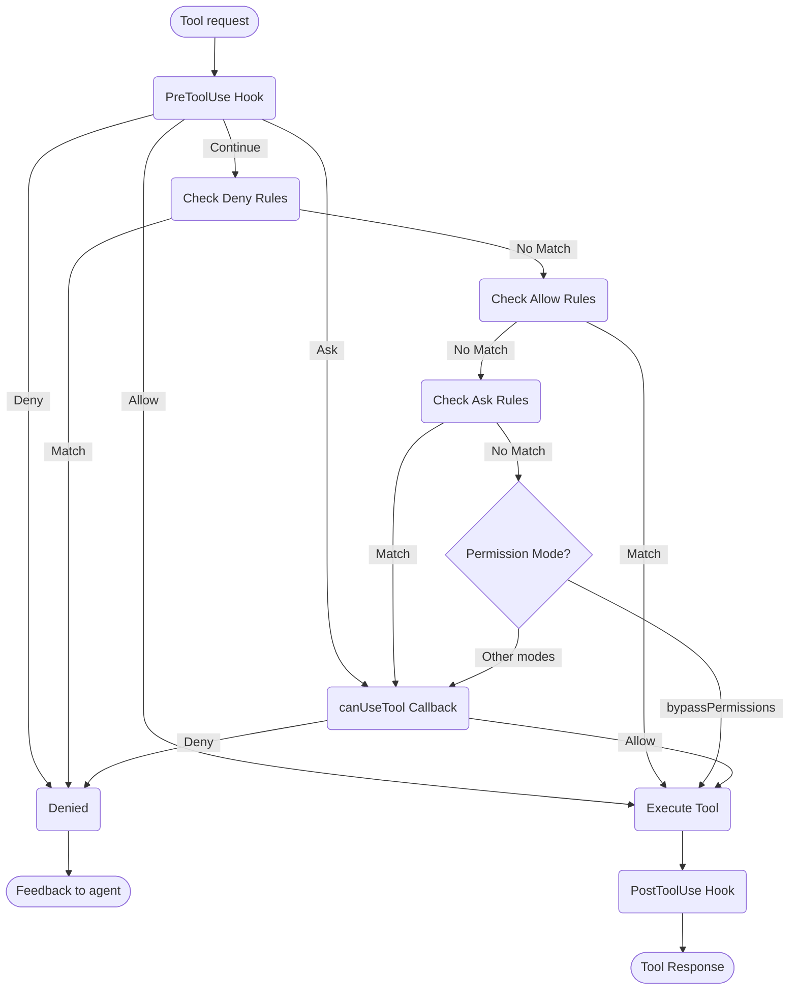

# Handling Permissions

Control tool usage and permissions in the Claude Agent SDK

---

# SDK Permissions

The Claude Agent SDK provides powerful permission controls that allow you to
manage how Claude uses tools in your application.

This guide covers how to implement permission systems using the `canUseTool`
callback, hooks, and settings.json permission rules. For complete API
documentation, see the
[TypeScript SDK reference](/docs/en/agent-sdk/typescript).

## Overview

The Claude Agent SDK provides four complementary ways to control tool usage:

1. **[Permission Modes](#permission-modes)** - Global permission behavior
   settings that affect all tools
2. **[canUseTool callback](/docs/en/agent-sdk/typescript#canusetool)** - Runtime
   permission handler for cases not covered by other rules
3. **[Hooks](/docs/en/agent-sdk/hooks)** - Fine-grained control over every tool
   execution with custom logic
4. **[Permission rules (settings.json)](https://code.claude.com/docs/en/settings#permission-settings)** -
   Declarative allow/deny rules with integrated bash command parsing

Use cases for each approach:

- Permission modes - Set overall permission behavior (planning, auto-accepting
  edits, bypassing checks)
- `canUseTool` - Dynamic approval for uncovered cases, prompts user for
  permission
- Hooks - Programmatic control over all tool executions
- Permission rules - Static policies with intelligent bash command parsing

## Permission Flow Diagram



**Processing Order:** PreToolUse Hook → Deny Rules → Allow Rules → Ask Rules →
Permission Mode Check → canUseTool Callback → PostToolUse Hook

## Permission Modes

Permission modes provide global control over how Claude uses tools. You can set
the permission mode when calling `query()` or change it dynamically during
streaming sessions.

### Available Modes

The SDK supports four permission modes, each with different behavior:

| Mode                | Description                  | Tool Behavior                                                   |
| :------------------ | :--------------------------- | :-------------------------------------------------------------- |
| `default`           | Standard permission behavior | Normal permission checks apply                                  |
| `plan`              | Planning mode                | No tool execution; Claude plans without making changes          |
| `acceptEdits`       | Auto-accept file edits       | File edits and filesystem operations are automatically approved |
| `bypassPermissions` | Bypass all permission checks | All tools run without permission prompts (use with caution)     |

### Setting Permission Mode

You can set the permission mode in two ways:

#### 1. Initial Configuration

Set the mode when creating a query:

<CodeGroup>

```typescript TypeScript
import { query } from "@anthropic-ai/claude-agent-sdk";

const result = await query({
  prompt: "Help me refactor this code",
  options: {
    permissionMode: "default", // Standard permission mode
  },
});
```

```python Python
from claude_agent_sdk import query

result = await query(
    prompt="Help me refactor this code",
    options={
        "permission_mode": "default"  # Standard permission mode
    }
)
```

</CodeGroup>

#### 2. Dynamic Mode Changes (Streaming Only)

Change the mode during a streaming session:

<CodeGroup>

```typescript TypeScript
import { query } from "@anthropic-ai/claude-agent-sdk";

// Create an async generator for streaming input
async function* streamInput() {
  yield {
    type: "user",
    message: {
      role: "user",
      content: "Let's start with default permissions",
    },
  };

  // Later in the conversation...
  yield {
    type: "user",
    message: {
      role: "user",
      content: "Now let's speed up development",
    },
  };
}

const q = query({
  prompt: streamInput(),
  options: {
    permissionMode: "default", // Start in default mode
  },
});

// Change mode dynamically
await q.setPermissionMode("acceptEdits");

// Process messages
for await (const message of q) {
  console.log(message);
}
```

```python Python
from claude_agent_sdk import query

async def stream_input():
    """Async generator for streaming input"""
    yield {
        "type": "user",
        "message": {
            "role": "user",
            "content": "Let's start with default permissions"
        }
    }

    # Later in the conversation...
    yield {
        "type": "user",
        "message": {
            "role": "user",
            "content": "Now let's speed up development"
        }
    }

q = query(
    prompt=stream_input(),
    options={
        "permission_mode": "default"  # Start in default mode
    }
)

# Change mode dynamically
await q.set_permission_mode("acceptEdits")

# Process messages
async for message in q:
    print(message)
```

</CodeGroup>

### Mode-Specific Behaviors

#### Accept Edits Mode (`acceptEdits`)

In accept edits mode:

- All file edits are automatically approved
- Filesystem operations (mkdir, touch, rm, etc.) are auto-approved
- Other tools still require normal permissions
- Speeds up development when you trust Claude's edits
- Useful for rapid prototyping and iterations

Auto-approved operations:

- File edits (Edit, Write tools)
- Bash filesystem commands (mkdir, touch, rm, mv, cp)
- File creation and deletion

#### Bypass Permissions Mode (`bypassPermissions`)

In bypass permissions mode:

- **ALL tool uses are automatically approved**
- No permission prompts appear
- Hooks still execute (can still block operations)
- **Use with extreme caution** - Claude has full system access
- Recommended only for controlled environments

### Mode Priority in Permission Flow

Permission modes are evaluated at a specific point in the permission flow:

1. **Hooks execute first** - Can allow, deny, ask, or continue
2. **Deny rules** are checked - Block tools regardless of mode
3. **Allow rules** are checked - Permit tools if matched
4. **Ask rules** are checked - Prompt for permission if matched
5. **Permission mode** is evaluated:
   - **`bypassPermissions` mode** - If active, allows all remaining tools
   - **Other modes** - Defer to `canUseTool` callback
6. **`canUseTool` callback** - Handles remaining cases

This means:

- Hooks can always control tool use, even in `bypassPermissions` mode
- Explicit deny rules override all permission modes
- Ask rules are evaluated before permission modes
- `bypassPermissions` mode overrides the `canUseTool` callback for unmatched
  tools

### Best Practices

1. **Use default mode** for controlled execution with normal permission checks
2. **Use acceptEdits mode** when working on isolated files or directories
3. **Avoid bypassPermissions** in production or on systems with sensitive data
4. **Combine modes with hooks** for fine-grained control
5. **Switch modes dynamically** based on task progress and confidence

Example of mode progression:

```typescript
// Start in default mode for controlled execution
permissionMode: "default";

// Switch to acceptEdits for rapid iteration
await q.setPermissionMode("acceptEdits");
```

## allowedTools and Tool Filtering

The `allowedTools` option is the primary mechanism for restricting which tools
an agent can use. Understanding how it interacts with the SDK is critical for
building secure agent boundaries.

### How allowedTools Works

When you pass `allowedTools` to `query()`, only the listed tools are available
to Claude. Any tool not in the list is silently unavailable — Claude will not
attempt to use it.

```typescript
const result = query({
  prompt: "Analyze this code",
  options: {
    allowedTools: ["Read", "Glob", "Grep"], // Only these 3 tools available
  },
});
```

### SDK Init Message vs Effective Restrictions

**Important:** The `SDKSystemMessage` (type `"system"`, subtype `"init"`)
contains a `tools` field that lists **all available tools** registered in the
SDK runtime, not the filtered set. This is informational and does not reflect
the effective restrictions.

```typescript
// SDK init message example
{
  type: "system",
  subtype: "init",
  tools: ["Read", "Write", "Edit", "Bash", ...], // All 22+ tools
  // ...
}
```

The `allowedTools` restriction is enforced **at tool usage time**, not at
initialization. When Claude attempts to use a tool not in `allowedTools`, the
SDK blocks the call before execution.

**Summary of the flow:**

```
agent.json allowedTools ──→ filterAllowedTools() ──→ SDK query options
                               (step-kind filter)      ↓
                                                   SDK enforces at
                                                   tool usage time
```

### Tool Filtering in Climpt Agents

Climpt agents use a two-layer tool filtering system:

1. **Static filter (`allowedTools` in agent.json):** Defines the base set of
   tools the agent can use across all steps.

2. **Dynamic filter (`filterAllowedTools()`):** Further restricts tools based on
   the current step kind (work, verification, closure). This prevents boundary
   actions (like closing GitHub issues) during work steps.

```
agent.json allowedTools: ["Read", "Write", "Edit", "Bash", "Glob", "Grep",
                          "githubIssueClose", "githubPrMerge", ...]
                                    │
                                    ▼
                        filterAllowedTools(tools, stepKind)
                                    │
                    ┌───────────────┼───────────────┐
                    │               │               │
                    ▼               ▼               ▼
              work step      verification     closure step
              (6 tools)      (6 tools)        (all tools)
              No boundary    No boundary      Boundary tools
              tools          tools            included
```

#### Step Kind Categories

| Step Kind      | Available Tools                    | Boundary Tools |
| :------------- | :--------------------------------- | :------------- |
| `work`         | Base tools (Read, Write, Edit ...) | Blocked        |
| `verification` | Base tools (Read, Write, Edit ...) | Blocked        |
| `closure`      | Base tools + Boundary tools        | Allowed        |

#### Base Tools vs Boundary Tools

**Base Tools** (always available): `Bash`, `Read`, `Write`, `Edit`, `Glob`,
`Grep`, `WebFetch`, `WebSearch`, `Task`, `TodoWrite`

**Boundary Tools** (closure only): `githubIssueClose`, `githubIssueUpdate`,
`githubIssueComment`, `githubPrClose`, `githubPrMerge`, `githubPrUpdate`,
`githubReleaseCreate`, `githubReleasePublish`

### Designing Secure Agent Boundaries

To structurally guarantee tool restrictions:

1. **Use `allowedTools` as the primary guard.** Only list tools the agent
   genuinely needs. Do not rely solely on `permissionMode` for safety.

2. **Verify tool restrictions in logs.** Look for the `[ToolPolicy]` log entry
   that shows the filtered tool count:
   ```
   [ToolPolicy] Step "dev" (work): tools filtered to 6 allowed
   ```

3. **Combine with `canUseTool` for runtime checks.** Use the callback for
   additional validation beyond the static list.

4. **Do not confuse SDK init tools with effective restrictions.** The init
   message's `tools` array is informational. The `allowedTools` option is the
   effective filter.

## canUseTool

The `canUseTool` callback is passed as an option when calling the `query`
function. It receives the tool name and input parameters, and must return a
decision- either allow or deny.

canUseTool fires whenever Claude Code would show a permission prompt to a user,
e.g. hooks and permission rules do not cover it and it is not in acceptEdits
mode.

Here's a complete example showing how to implement interactive tool approval:

<CodeGroup>

```typescript TypeScript
import { query } from "@anthropic-ai/claude-agent-sdk";

async function promptForToolApproval(toolName: string, input: any) {
  console.log("\n🔧 Tool Request:");
  console.log(`   Tool: ${toolName}`);

  // Display tool parameters
  if (input && Object.keys(input).length > 0) {
    console.log("   Parameters:");
    for (const [key, value] of Object.entries(input)) {
      let displayValue = value;
      if (typeof value === "string" && value.length > 100) {
        displayValue = value.substring(0, 100) + "...";
      } else if (typeof value === "object") {
        displayValue = JSON.stringify(value, null, 2);
      }
      console.log(`     ${key}: ${displayValue}`);
    }
  }

  // Get user approval (replace with your UI logic)
  const approved = await getUserApproval();

  if (approved) {
    console.log("   ✅ Approved\n");
    return {
      behavior: "allow",
      updatedInput: input,
    };
  } else {
    console.log("   ❌ Denied\n");
    return {
      behavior: "deny",
      message: "User denied permission for this tool",
    };
  }
}

// Use the permission callback
const result = await query({
  prompt: "Help me analyze this codebase",
  options: {
    canUseTool: async (toolName, input) => {
      return promptForToolApproval(toolName, input);
    },
  },
});
```

```python Python
from claude_agent_sdk import query

async def prompt_for_tool_approval(tool_name: str, input_params: dict):
    print(f"\n🔧 Tool Request:")
    print(f"   Tool: {tool_name}")

    # Display parameters
    if input_params:
        print("   Parameters:")
        for key, value in input_params.items():
            display_value = value
            if isinstance(value, str) and len(value) > 100:
                display_value = value[:100] + "..."
            elif isinstance(value, (dict, list)):
                display_value = json.dumps(value, indent=2)
            print(f"     {key}: {display_value}")

    # Get user approval
    answer = input("\n   Approve this tool use? (y/n): ")

    if answer.lower() in ['y', 'yes']:
        print("   ✅ Approved\n")
        return {
            "behavior": "allow",
            "updatedInput": input_params
        }
    else:
        print("   ❌ Denied\n")
        return {
            "behavior": "deny",
            "message": "User denied permission for this tool"
        }

# Use the permission callback
result = await query(
    prompt="Help me analyze this codebase",
    options={
        "can_use_tool": prompt_for_tool_approval
    }
)
```

</CodeGroup>

## Handling the AskUserQuestion Tool

The `AskUserQuestion` tool allows Claude to ask the user clarifying questions
during a conversation. When this tool is called, your `canUseTool` callback
receives the questions and must return the user's answers.

### Input Structure

When `canUseTool` is called with `toolName: "AskUserQuestion"`, the input
contains:

```typescript
{
  questions: [
    {
      question: "Which database should we use?",
      header: "Database",
      options: [
        { label: "PostgreSQL", description: "Relational, ACID compliant" },
        { label: "MongoDB", description: "Document-based, flexible schema" },
      ],
      multiSelect: false,
    },
    {
      question: "Which features should we enable?",
      header: "Features",
      options: [
        { label: "Authentication", description: "User login and sessions" },
        { label: "Logging", description: "Request and error logging" },
        { label: "Caching", description: "Redis-based response caching" },
      ],
      multiSelect: true,
    },
  ];
}
```

### Returning Answers

Return the answers in `updatedInput.answers` as a record mapping question text
to the selected option label(s):

```typescript
return {
  behavior: "allow",
  updatedInput: {
    questions: input.questions, // Pass through original questions
    answers: {
      "Which database should we use?": "PostgreSQL",
      "Which features should we enable?": "Authentication, Caching",
    },
  },
};
```

<Note>
Multi-select answers are comma-separated strings (e.g., `"Authentication, Caching"`).
</Note>

## Related Resources

- [Hooks Guide](/docs/en/agent-sdk/hooks) - Learn how to implement hooks for
  fine-grained control over tool execution
- [Settings: Permission Rules](https://code.claude.com/docs/en/settings#permission-settings) -
  Configure declarative allow/deny rules with bash command parsing
