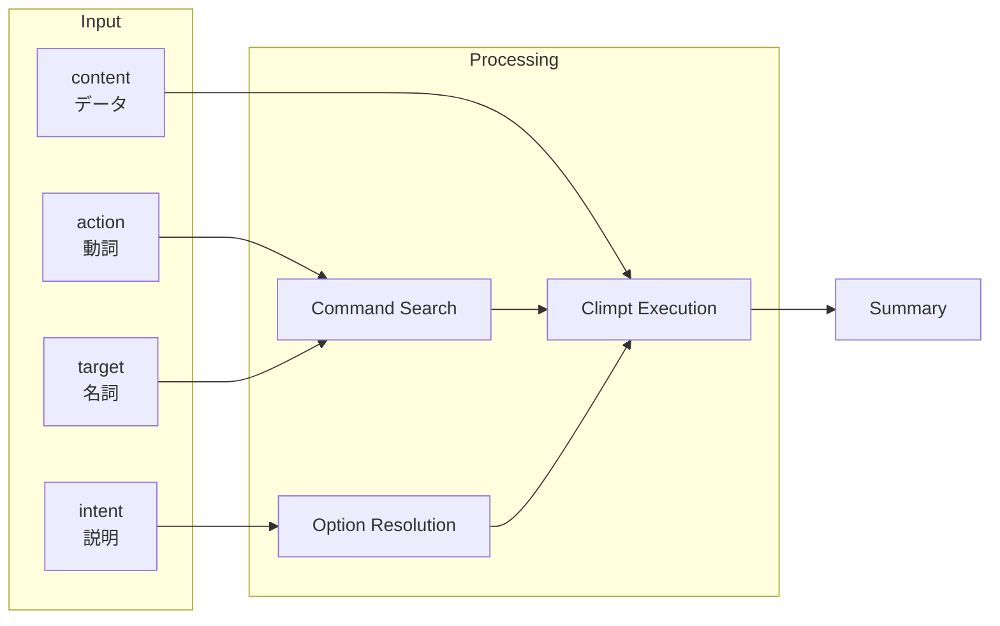

# Delegate Climpt Agent

Climpt コマンドレジストリを通じた開発タスク委譲。

## Input / Output

### Input

| Component   | Passed via     | Why                                                    |
| ----------- | -------------- | ------------------------------------------------------ |
| **action**  | `--action` arg | 動詞でコマンド種別(create/test/commit等)にマッチさせる |
| **target**  | `--target` arg | 名詞で対象物(file/test/document等)にマッチさせる       |
| **intent**  | `--intent` arg | オプション選択のヒント(edition/adaptation等)を与える   |
| **content** | stdin pipe     | 処理対象の実データ(diff/spec等)を climpt に渡す        |

**intent vs content の区別**:

- `intent`: 「どう処理するか」→ オプション選択用の短い説明
- `content`: 「何を処理するか」→ climpt が処理する実データ

### Output

サブエージェント実行結果のサマリー（stdout に出力）



## Usage

### Step 1: パラメータ作成

| パラメータ | 形式           | 例                           |
| ---------- | -------------- | ---------------------------- |
| action     | 動詞中心 ~6語  | "run execute test verify"    |
| target     | 名詞中心 ~6語  | "specific file unit test"    |
| intent     | 任意言語 1-2文 | "options-prompt.ts をテスト" |

### Step 2: 実行

```bash
deno run --allow-read --allow-write --allow-net --allow-env --allow-run --allow-sys \
  -- ${CLAUDE_PLUGIN_ROOT}/skills/delegate-climpt-agent/scripts/climpt-agent.ts \
  --action="<verbs>" --target="<nouns>" [--intent="<description>"]
```

**Sandbox**: `dangerouslyDisableSandbox: true` 必須

### Step 3: stdin（該当時のみ）

| 使う場面                           | 使わない場面     |
| ---------------------------------- | ---------------- |
| コミット(diff)、生成(spec/context) | テスト実行、検索 |

```bash
git diff --staged | deno run ... -- <script.ts> \
  --action="commit save stage" --target="changes semantic" \
  --intent="新機能追加"
```

## When to Use

a. プロジェクト固有の指示で、一般知識では対応が不明な場合。 b.
一般的な指示だが、もっと深いドメイン理解に基づいて処理する場合。

## Error Handling

| エラー                    | 対処                                             |
| ------------------------- | ------------------------------------------------ |
| 検索結果なし              | クエリを言い換えて再試行                         |
| スクリプト失敗            | Deno/Claude Agent SDK/権限を確認                 |
| "Import directory failed" | `deno.json` に `"nodeModulesDir": "auto"` を追加 |
