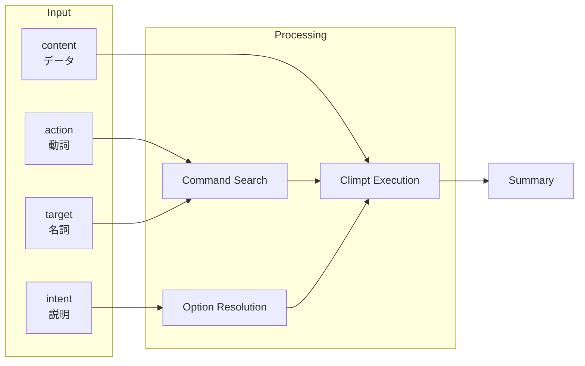

# Delegate Climpt Agent

Climpt コマンドレジストリを通じた開発タスク委譲。

## Input / Output

### Input

| Component   | Passed via     | Why                                                    |
| ----------- | -------------- | ------------------------------------------------------ |
| **action**  | `--action` arg | 動詞でコマンド種別(create/test/commit等)にマッチさせる |
| **target**  | `--target` arg | 名詞で対象物(file/test/document等)にマッチさせる       |
| **intent**  | `--intent` arg | オプション選択のヒント(edition/adaptation等)を与える   |
| **content** | stdin pipe     | 処理対象の実データ(diff/spec等)を climpt に渡す        |

**intent vs content の区別**:

- `intent`: 「どう処理するか」→ オプション選択用の短い説明
- `content`: 「何を処理するか」→ climpt が処理する実データ

### Output

サブエージェント実行結果のサマリー（stdout に出力）



## Usage

### Step 1: パラメータ作成

| パラメータ | 形式           | 例                           |
| ---------- | -------------- | ---------------------------- |
| action     | 動詞中心 ~6語  | "run execute test verify"    |
| target     | 名詞中心 ~6語  | "specific file unit test"    |
| intent     | 任意言語 1-2文 | "options-prompt.ts をテスト" |

### Step 2: 実行

```bash
deno run --allow-read --allow-write --allow-net --allow-env --allow-run --allow-sys \
  -- ${CLAUDE_PLUGIN_ROOT}/skills/delegate-climpt-agent/scripts/climpt-agent.ts \
  --action="<verbs>" --target="<nouns>" [--intent="<description>"]
```

**Sandbox**: `dangerouslyDisableSandbox: true` 必須

### Step 3: stdin（該当時のみ）

| 使う場面                           | 使わない場面     |
| ---------------------------------- | ---------------- |
| コミット(diff)、生成(spec/context) | テスト実行、検索 |

```bash
git diff --staged | deno run ... -- <script.ts> \
  --action="commit save stage" --target="changes semantic" \
  --intent="新機能追加"
```

## When to Use

a. プロジェクト固有の指示で、一般知識では対応が不明な場合。 b.
一般的な指示だが、もっと深いドメイン理解に基づいて処理する場合。

## Error Handling

| エラー                    | 対処                                             |
| ------------------------- | ------------------------------------------------ |
| 検索結果なし              | クエリを言い換えて再試行                         |
| スクリプト失敗            | Deno/Claude Agent SDK/権限を確認                 |
| "Import directory failed" | `deno.json` に `"nodeModulesDir": "auto"` を追加 |

## Related: Autonomous Agents

Climpt には自律型エージェントシステム（Iterator Agent, Reviewer Agent）があり、
長時間の自律開発タスクを実行できる。詳細は以下を参照。

### Iterator Agent

GitHub Issue/Project から要件を取得し、完了条件を満たすまで反復実行する自律型エージェント。

```bash
# Issue モード: Issue がクローズされるまで実行
deno run -A jsr:@aidevtool/climpt/agents/iterator --issue 123

# Project モード: プロジェクトの全フェーズを完了するまで実行
deno run -A jsr:@aidevtool/climpt/agents/iterator --project 5

# Iterate モード: 指定回数だけ反復実行
deno run -A jsr:@aidevtool/climpt/agents/iterator --iterate-max 10
```

### Reviewer Agent

実装が要件を満たしているかを検証し、不足箇所を Issue として登録する自律型エージェント。

```bash
# プロジェクト全体をレビュー（docs/review ラベルを使用）
deno run -A jsr:@aidevtool/climpt/agents/reviewer --project 25
```

### Agent Architecture

```
agents/
├── common/                # 共有モジュール
│   ├── types.ts           # 型定義
│   ├── logger.ts          # JSONL ロガー
│   ├── worktree.ts        # Git worktree 操作
│   ├── merge.ts           # ブランチマージ
│   └── coordination.ts    # Agent 間連携
├── iterator/              # Iterator Agent
│   ├── config.json        # 設定
│   ├── registry.json      # プロンプトレジストリ
│   └── prompts/           # プロンプトテンプレート
├── reviewer/              # Reviewer Agent
│   └── ...
└── docs/                  # 設計ドキュメント
```

### Key Configuration Files

| ファイル               | 用途                                  |
| ---------------------- | ------------------------------------- |
| `config.json`          | Agent 設定（ツール、権限、ロギング）  |
| `registry.json`        | プロンプトレジストリ                  |
| `steps_registry.json`  | ステップ定義（C3L パスマッピング）    |
| `prompts/system.md`    | システムプロンプト                    |
| `prompts/steps/`       | フェーズ別プロンプトテンプレート      |

### Programmatic Usage

```typescript
import { runIterator, runReviewer } from "jsr:@aidevtool/climpt/agents";

// Iterator Agent
const result = await runIterator({
  issue: 123,
  cwd: Deno.cwd(),
});

// Reviewer Agent
const reviewResult = await runReviewer({
  project: 25,
  cwd: Deno.cwd(),
});
```

詳細は `agents/docs/` 配下のドキュメントを参照。
